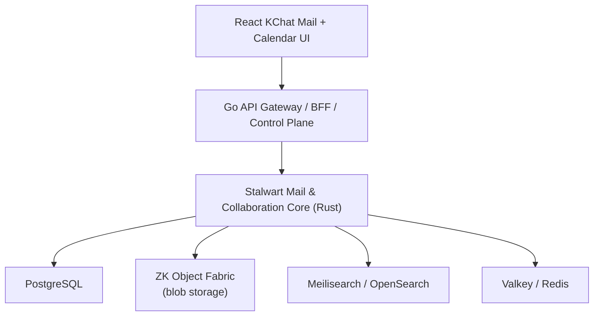
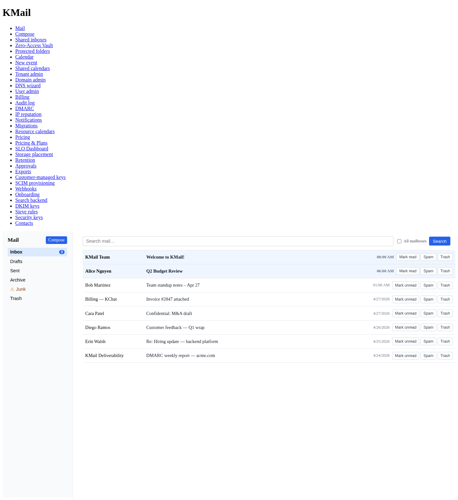
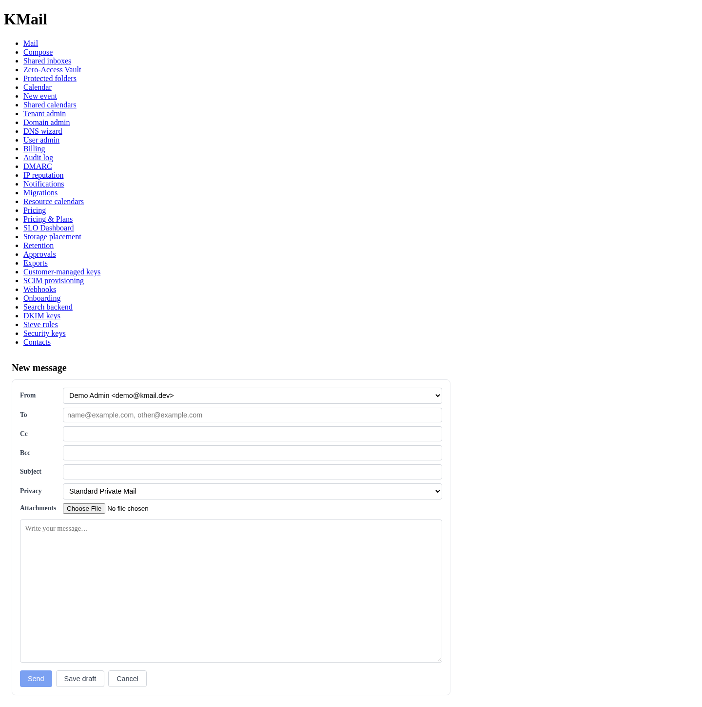
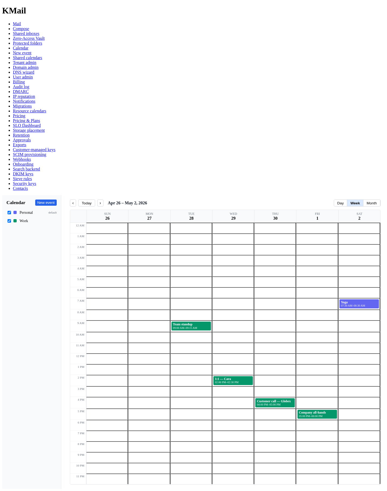
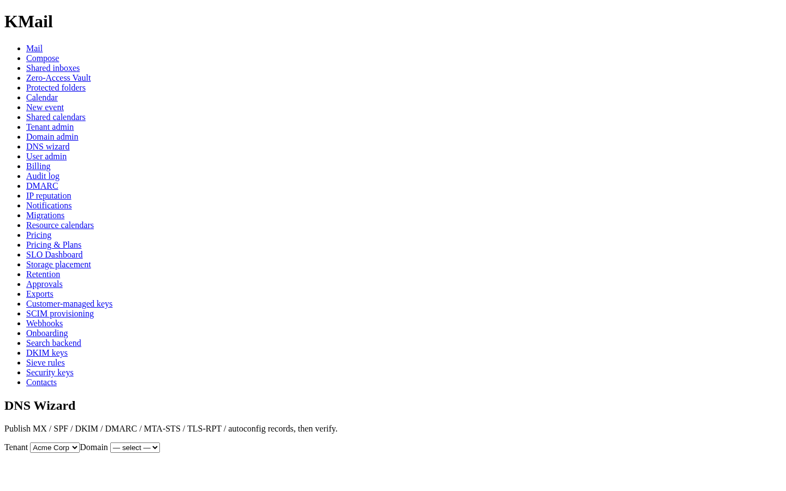
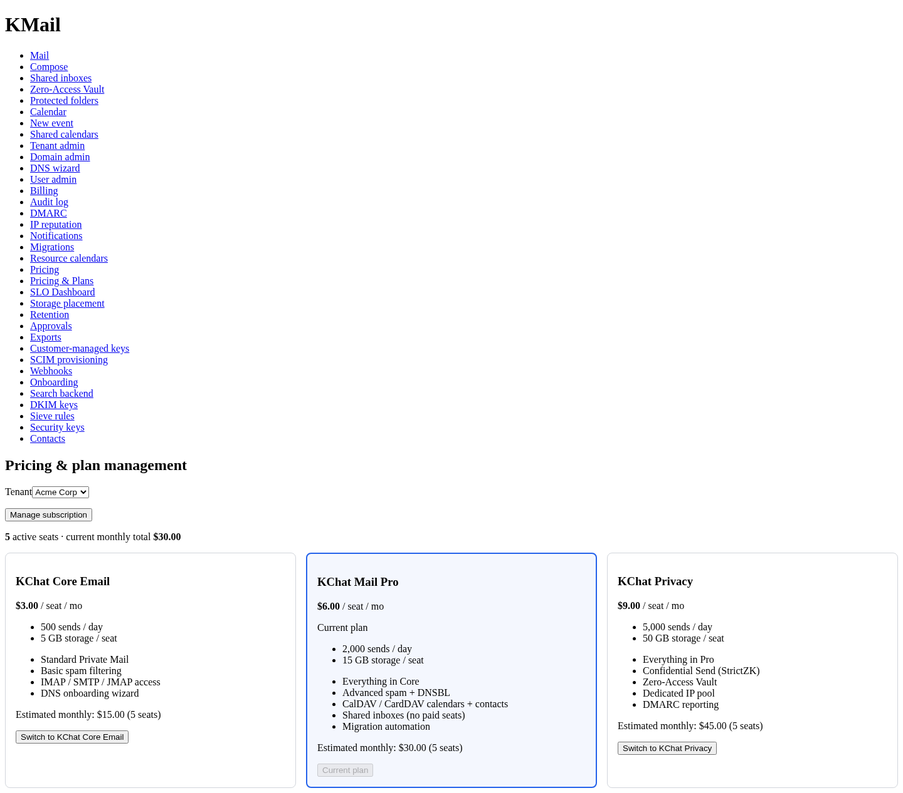
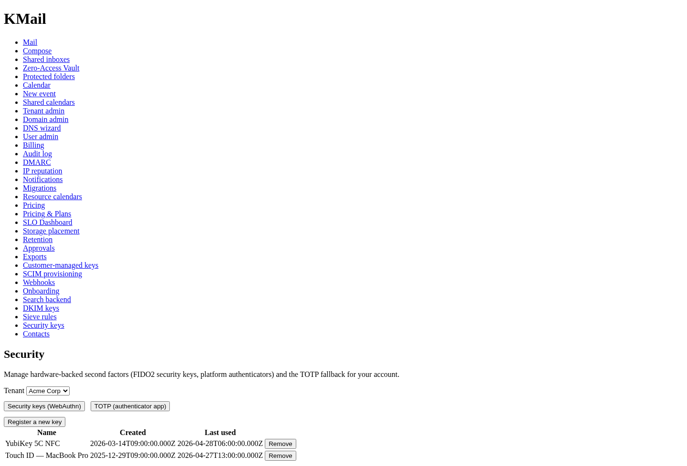
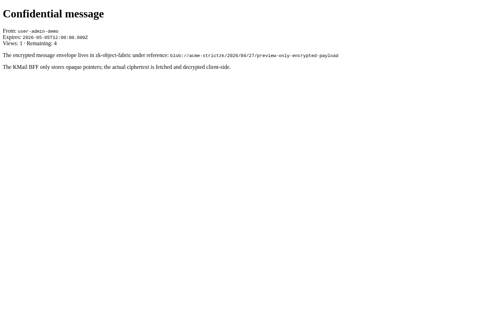
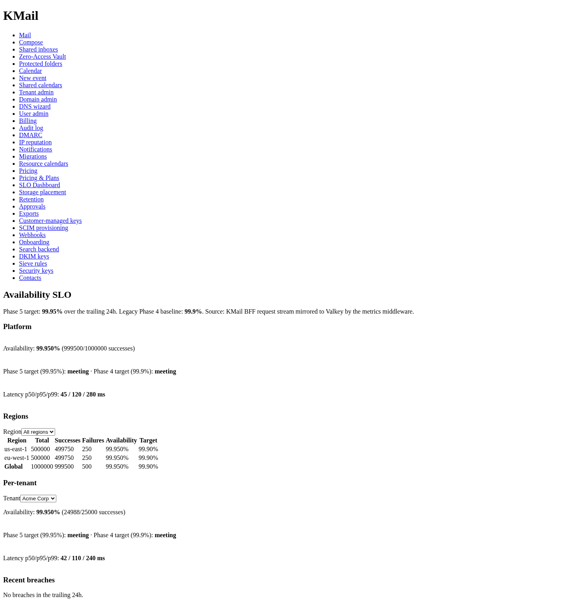
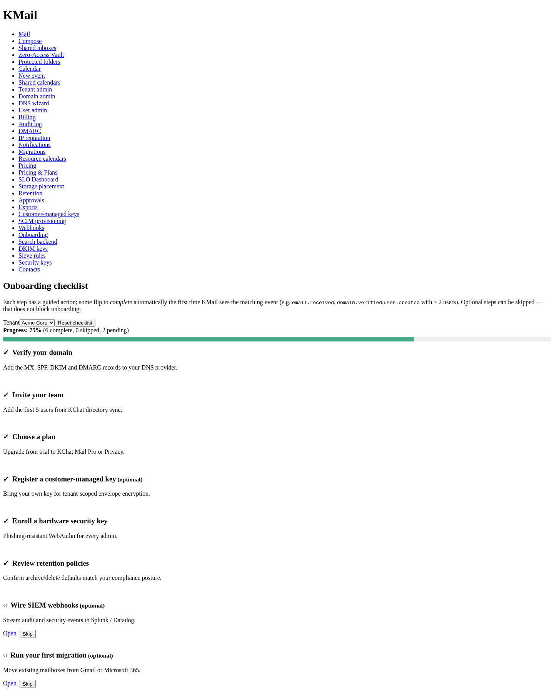

# KMail — Privacy Email & Calendar for KChat B2B

> Private business email, shared inboxes, and calendar embedded in
> KChat B2B. Built on Stalwart (Rust) for the mail/collaboration core,
> a Go control plane, and a React frontend. Mail blobs and attachments
> are stored through [zk-object-fabric](https://github.com/kennguy3n/zk-object-fabric)
> with per-tenant ZK encryption; encryption keys are derived from
> KChat's MLS key hierarchy.

**License**: Proprietary — All Rights Reserved. See [LICENSE](LICENSE).

## What it is

KMail is a privacy-centric email and calendar service embedded in KChat
B2B. It is **not** a standalone mailbox product. It is email and
calendar as a **KChat workflow** — custom-domain email, shared
inboxes, calendar, and migration for SMEs, delivered inside the same
workspace where teams already chat.

The positioning is deliberate: KMail is **"private business
communication inside KChat"**, not **"cheaper Gmail"**. Email and
calendar are a retention and ARPU expansion layer inside the KChat
B2B core, not a standalone competitor to Gmail, Microsoft 365, or
Proton.

It serves:

- **5–100 seat SMEs** that want custom-domain business email on a
  privacy-preserving platform without running their own mail server.
- **Service businesses** (agencies, law firms, accounting practices,
  clinics, design studios) that need shared inboxes (`sales@`,
  `support@`, `info@`), team calendars, and audit trails.
- **Privacy-conscious firms** that need confidential send and
  zero-access vaults for sensitive communication.
- **Existing KChat teams** who want a single workspace for chat,
  email, and calendar without paying seat-plus-seat for three SaaS
  products.

## Key differentiators

- **Embedded in KChat** — email, calendar, and chat in one SME
  workspace; one login, one billing relationship, one audit log, one
  admin surface. Email is a first-class KChat workflow, not a
  separate app.
- **MLS encryption synergy** — KChat's MLS (Messaging Layer Security)
  key tree extends to email. MLS-derived keys wrap confidential-send
  envelopes, unlock protected folders, and key shared-inbox groups.
  The same cryptographic identity a user has in KChat chat is the
  identity that unlocks their private mail.
- **ZK Object Fabric storage** — mail blobs, attachments, and large
  calendar/contact objects are stored through
  [zk-object-fabric](https://github.com/kennguy3n/zk-object-fabric)'s
  S3-compatible gateway with per-tenant ZK encryption, content-
  addressed deduplication (tenant-scoped only), and tiered caching
  (L0 memory, L1 NVMe, L2 durable origin).
- **Privacy-centric by default** — no ads, no content mining, TLS
  everywhere, encryption at rest, tenant isolation, strong auth,
  admin audit logs. Not Proton-style zero-access by default (that
  breaks spam, search, IMAP, and mobile push) — instead, privacy as
  the default posture with opt-in privacy escalation.
- **Three privacy modes** — Standard Private Mail, Confidential Send,
  and Zero-Access Vault. Each maps to an explicit encryption mode in
  zk-object-fabric (`ManagedEncrypted`, `StrictZK`, `StrictZK`
  respectively) and, where applicable, to an MLS key derivation path.
- **JMAP-first client strategy** — the KChat web and mobile clients
  speak [JMAP](https://jmap.io/) through a Go BFF. IMAP, SMTP,
  CalDAV, CardDAV, and WebDAV are supported for third-party client
  compatibility (Thunderbird, Apple Mail, and native calendar
  clients) but are not the primary UX path.

## Architecture summary

- **React KChat Mail + Calendar UI** is a native KChat surface. Users
  do not "leave chat" to use email.
- **Go API Gateway / BFF / Control Plane** handles KChat auth, tenant
  policy, UI-facing JMAP, provisioning, DNS onboarding, migration
  orchestration, billing, deliverability, and the KChat chat bridge.
- **Stalwart Mail & Collaboration Core (Rust)** handles SMTP, IMAP,
  JMAP, CalDAV, CardDAV, WebDAV, Sieve filtering, spam/phishing
  scoring, and protocol-level concerns. Pinned to
  [v0.16.0](https://github.com/stalwartlabs/mail-server/releases/tag/v0.16.0)
  (April 20, 2026), with v1.0.0 expected H1 2026.
- **PostgreSQL** stores tenant metadata, users, domains, mailbox
  state, calendar metadata, and quotas.
- **ZK Object Fabric** stores raw RFC 5322 blobs, attachments, and
  large calendar/contact objects via S3-compatible API with
  per-tenant encryption keys.
- **Meilisearch → OpenSearch** provides full-text search (Meilisearch
  at SME scale; OpenSearch when we outgrow it).
- **Valkey / Redis** stores sessions, rate limits, auth tokens, and
  queue hints.

See [docs/ARCHITECTURE.md](docs/ARCHITECTURE.md) for full diagrams and
service topology.

## Encryption & storage synergy

KMail's privacy model is built from the union of two existing
systems — KChat's MLS key tree and zk-object-fabric's encryption
envelope. Nothing in KMail reinvents key management; KMail composes
primitives that already ship in the rest of the KChat stack.

### MLS key tree → email encryption

KChat already uses MLS (Messaging Layer Security) to provide
forward-secret, post-compromise secure group messaging. MLS's tree-
based key schedule produces per-epoch group keys; every member has a
leaf key and a credential.

KMail reuses that key material:

- **Confidential-send envelope keys** — the sender's MLS leaf key
  derives a per-message DEK-wrapping key. The recipient opens the
  envelope by deriving the same key from their own MLS membership.
  External recipients use a portal that performs an MLS key exchange
  out-of-band.
- **Protected-folder encryption keys** — a user's MLS credential
  derives a folder master key; each message in the folder is
  encrypted with a per-message DEK wrapped by that master key.
- **Shared-inbox group keys** — a shared inbox (`sales@`,
  `support@`) is mapped to an MLS group; every current member can
  decrypt, and membership changes trigger MLS epoch rotation.

This unifies encryption lifecycle across chat and email. The user
identity that owns their KChat membership owns their mailbox; there
is no parallel email-only key hierarchy.

### zk-object-fabric encryption modes → KMail privacy modes

zk-object-fabric supports three `EncryptionMode` values, which map
directly to KMail privacy modes:

| KMail Privacy Mode      | zk-object-fabric mode  | MLS role                                       | Server search |
| ----------------------- | ---------------------- | ---------------------------------------------- | ------------- |
| Standard Private Mail   | `ManagedEncrypted`     | None — gateway manages keys                    | Full          |
| Confidential Send       | `StrictZK`             | MLS leaf key derives DEK wrapping key          | Metadata only |
| Zero-Access Vault       | `StrictZK`             | MLS credential derives folder master key       | None          |
| Attachment link sharing | `PublicDistribution`   | None — encrypted at origin, expiring links     | N/A           |

- Every mail blob carries a **per-object DEK + CMK envelope** from
  zk-object-fabric's encryption layer. That envelope extends naturally
  to per-message encryption — there is no custom KMail crypto on top
  of it.
- **Tenant-scoped blob namespaces** are enforced by zk-object-fabric.
  Content-addressed deduplication never crosses tenant boundaries, so
  one tenant's mail content cannot leak metadata about another
  tenant's content through hash collisions.

See [docs/PROPOSAL.md](docs/PROPOSAL.md) for the detailed MLS /
ZK Object Fabric integration model.

## Target customers

- **5–100 seat SMEs** — the core wedge. Customers large enough to
  need custom-domain email, shared inboxes, and admin controls, but
  small enough that Microsoft 365 / Google Workspace feels like
  overkill or a privacy liability.
- **Service businesses** — agencies, law firms, accounting practices,
  clinics, design studios. Heavy shared-inbox usage, low-volume
  outbound, privacy-sensitive communication.
- **Privacy-conscious firms** — customers that specifically value
  "no content mining, no ads, tenant-isolated encryption at rest"
  and are willing to pay a small premium for it.
- **Existing KChat teams** — the fastest conversion path. Teams
  already using KChat who add email rather than buying Google
  Workspace.

Deliberately out of scope for launch: high-volume cold outbound
senders, large regulated enterprises (HIPAA BAA, FINRA, SEC 17a-4
WORM), and Microsoft-Exchange-dependent organizations. Those
customers can come later; they are not the wedge.

## Tech stack

| Layer                     | Choice                      | Rationale                                                                                         |
| ------------------------- | --------------------------- | ------------------------------------------------------------------------------------------------- |
| Mail / collaboration core | [Stalwart](https://github.com/stalwartlabs/mail-server) (Rust) | SMTP / JMAP / IMAP / CalDAV / CardDAV / WebDAV, multi-tenant, OIDC, built-in spam & phishing     |
| Backend                   | Go                          | Control plane, APIs, provisioning, billing, DNS wizard, migration orchestrator, KChat chat bridge |
| Frontend                  | React + TypeScript          | Native KChat mail / calendar / admin UX                                                           |
| Metadata                  | PostgreSQL                  | Tenant metadata, users, domains, mailbox state, calendar metadata, quotas                         |
| Blob storage              | [ZK Object Fabric](https://github.com/kennguy3n/zk-object-fabric) | Mail blobs, attachments via S3-compatible API with per-tenant ZK encryption        |
| Search                    | Meilisearch → OpenSearch    | Lightweight at SME scale, distributed later                                                       |
| Cache / state             | Valkey / Redis              | Sessions, rate limits, auth tokens, queue hints                                                   |
| Migration                 | Go orchestrator + imapsync  | Proven IMAP migration tool, wrapped with tenant-scoped orchestration                              |

## Protocol model

| Client                       | Protocol                              |
| ---------------------------- | ------------------------------------- |
| KChat web app                | JMAP through Go BFF                   |
| KChat mobile                 | JMAP + push                           |
| Thunderbird / Apple Mail     | IMAP / SMTP                           |
| Calendar clients (native)    | CalDAV                                |
| Contacts clients (native)    | CardDAV                               |
| Admin UI                     | Go API                                |

JMAP is the primary client strategy because it is efficient over
mobile networks, supports push, and maps naturally to the KChat UI's
rendering model. IMAP / SMTP / CalDAV are supported for third-party
client compatibility but are not the main UX path.

## Privacy modes

| Mode                    | Description                                                                                                                     | Use                |
| ----------------------- | ------------------------------------------------------------------------------------------------------------------------------- | ------------------ |
| Standard Private Mail   | Server-side search and spam filtering; encryption at rest via zk-object-fabric `ManagedEncrypted`; no ads, no content mining.   | Default SME email  |
| Confidential Send       | External recipients read through an encrypted KChat portal; expiry, password, revocation; MLS-derived envelope keys.            | Sensitive messages |
| Zero-Access Vault       | Client-side encrypted folders via zk-object-fabric `StrictZK`; no server-side search; MLS key hierarchy for key management.     | Premium privacy    |

## Project status

**Phases 1–5 — complete. Phase 6 — Enterprise Readiness (in
progress, with Microsoft Exchange interop research and the BIMI
VMC issuance helper deferred per the do-not-do list). Phase 7 —
Production Hardening — complete. Phase 8 — GA Readiness — in
progress.** The schema now spans 45 migrations covering tenants,
Stalwart JMAP integration, retention, suppression and bounce
ledgers, ledger-driven audit, BYOK / per-tenant CMK + HSM with
real KMIP TTLV wire traffic, MLS-backed Confidential Send, the
Tenant Service, DNS Onboarding (auto-generated MX / SPF / DKIM /
DMARC / BIMI / autoconfig records), Stripe billing lifecycle on
tenant signup / plan change / delete (`stripe_customer_id` /
`stripe_subscription_id` columns), Sieve rules, WebAuthn / FIDO2
+ TOTP fallback, DKIM key rotation, search backend selection
(Meilisearch / OpenSearch), CardDAV global address list,
admin-proxy session expiry, free/busy publishing, and shared-
inbox MLS group key rotation. The platform stack ships with a
Helm chart for the kmail-api Deployment + Stalwart StatefulSet,
Loki / Promtail log shipping plus pre-built Grafana dashboards
(KMail Overview + Deliverability), a load-testing and chaos
harness (`make loadtest` / `make chaos`), an optional ClamAV
malware-scanning adapter wired as a JMAP submit-time pre-
delivery hook, RFC 8030 Web Push with VAPID, autoconfig /
autodiscover XML endpoints (Thunderbird + Outlook), SCIM 2.0
provisioning (with discovery + conformance harness), the
reverse access proxy with full audit, and a Stalwart v0 ↔ v1
compatibility shim (KMail still runs against v0.16.0 today;
v1.0.0 is expected H1 2026 and the shim makes the transition a
config flag). The React UI ships a complete admin surface
(domain, user, security, billing, retention, search, Sieve,
DKIM, webhooks, onboarding) plus the Mail / Calendar / Contacts
end-user surfaces.

See [docs/PROGRESS.md](docs/PROGRESS.md) for the phase-gated tracker.

## Screenshots

| | | |
|---|---|---|
|  |  |  |
| Mail Inbox | Compose | Calendar |
|  |  |  |
| DNS Wizard | Pricing ($3/$6/$9) | Security (WebAuthn + TOTP) |
|  |  |  |
| Confidential Send Portal | SLO Dashboard | Onboarding Checklist |

See [`docs/screenshots/`](docs/screenshots/) for the full set.

To regenerate the demo screenshots locally, run `make screenshots`.
That target boots a Vite dev server with `VITE_MOCK_API=true` so the
React UI renders against MSW handlers (no Go BFF required), then
captures each route into `docs/screenshots/`.

## Links

- [docs/PROPOSAL.md](docs/PROPOSAL.md) — detailed technical proposal.
- [docs/ARCHITECTURE.md](docs/ARCHITECTURE.md) — focused architecture
  document (data flow, encryption, multi-tenancy, deployment).
- [docs/PROGRESS.md](docs/PROGRESS.md) — phase-gated progress tracker.
- [ZK Object Fabric](https://github.com/kennguy3n/zk-object-fabric) —
  the underlying blob storage fabric.
- [Stalwart](https://github.com/stalwartlabs/mail-server) — the
  upstream mail / collaboration core.

## License

Proprietary — All Rights Reserved. See [LICENSE](LICENSE) for details.
