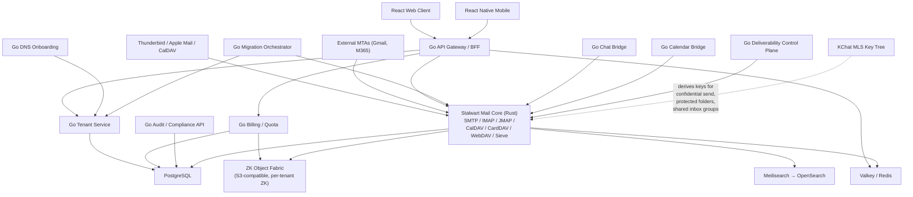
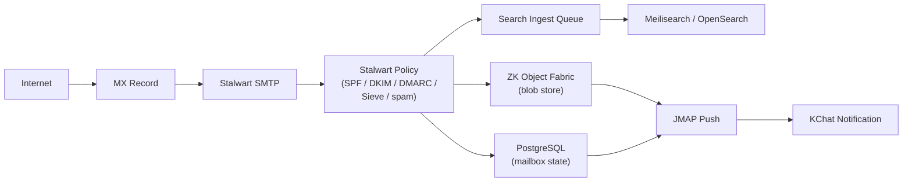
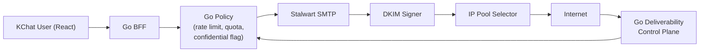
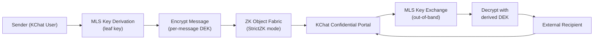
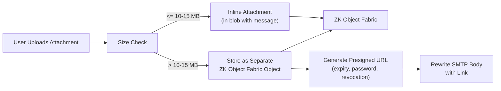
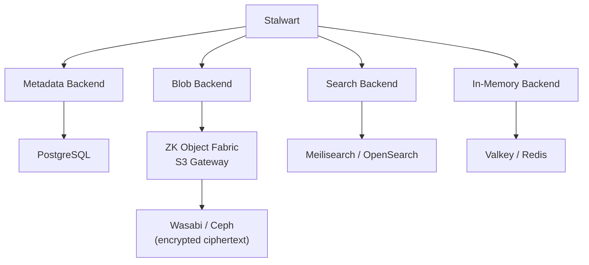
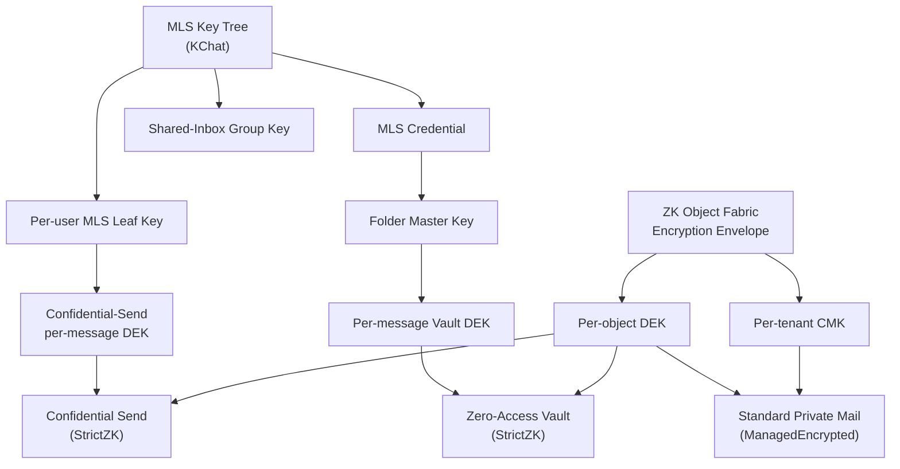
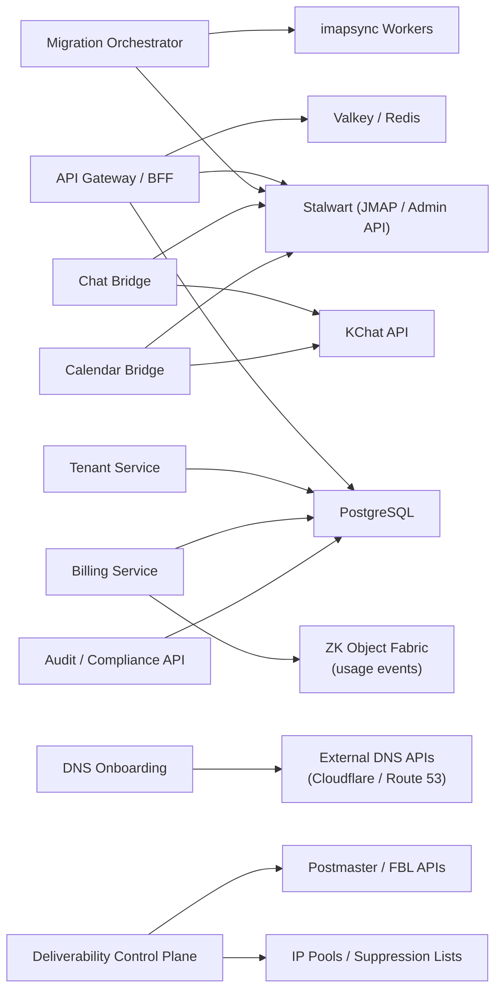

# KMail — Architecture

**License**: Proprietary — All Rights Reserved. See [LICENSE](../LICENSE).

> Status: Phase 1 — Foundation (in progress). This document defines the
> target architecture, not the current implementation. See
> [PROGRESS.md](PROGRESS.md) for build status. For strategy, pricing,
> and phased plan, see [PROPOSAL.md](PROPOSAL.md).

This document is the single source of truth for KMail's architecture.
It covers the system topology, three-layer integration model, data
flow diagrams, encryption architecture, multi-tenancy model, Go
service topology, protocol matrix, deployment architecture, and
search architecture.

---

## 1. System Overview

KMail is composed of five clear layers: a React client layer, a Go
control plane, the Stalwart (Rust) mail core, four storage systems,
and the zk-object-fabric blob fabric that sits underneath the blob
store. Each layer has a single responsibility and a stable contract
with the layer above and below.

---

## 2. Three-Layer Integration Model

KMail is the integration of three independently-owned systems. Each
layer has a well-defined contract; none of the three reinvents what
the others already provide.

### 2.1 KChat MLS Layer

- Provides: MLS group messaging, MLS credentials, per-user leaf
  keys, per-epoch group keys, forward secrecy, post-compromise
  security, efficient rekeying on membership change.
- Role in KMail: the **key hierarchy source**. All KMail encryption
  keys that are not managed by the zk-object-fabric gateway are
  derived from MLS material.
- Stable contract: MLS credential derivation API + shared-inbox
  MLS group membership API.

### 2.2 Stalwart Mail Core

- Provides: SMTP, IMAP, JMAP, CalDAV, CardDAV, WebDAV, Sieve
  filtering, spam/phishing scoring, multi-tenant mailbox
  management, OIDC.
- Role in KMail: the **protocol and mail-semantics layer**. Stalwart
  owns everything that is fundamentally about being a mail server —
  MIME, RFC 5322, SMTP retry queues, IMAP state, JMAP sync, CalDAV
  scheduling.
- Stable contract: Stalwart's configured storage backends
  (PostgreSQL for metadata, zk-object-fabric S3 for blobs,
  Meilisearch/OpenSearch for search, Valkey for in-memory state).

### 2.3 ZK Object Fabric Storage

- Provides: S3-compatible blob storage, per-tenant ZK encryption,
  content-addressed storage (BLAKE3 piece IDs), tiered caching
  (L0/L1/L2), pluggable backends (Wasabi, Ceph RGW, etc.),
  cloud-to-local migration, placement policies.
- Role in KMail: the **blob layer**. Every byte of mail content,
  attachment, and large calendar/contact object goes through
  zk-object-fabric.
- Stable contract: the zk-object-fabric S3-compatible API +
  `StorageProvider` interface + `EncryptionMode` envelope
  (`StrictZK`, `ManagedEncrypted`, `PublicDistribution`).

The union of these three layers is KMail. Any KMail-specific code
that tries to reimplement one of them is wrong.

---

## 3. Data Flow Diagrams

### 3.1 Inbound mail flow

### 3.2 Outbound mail flow

### 3.3 Confidential send flow

### 3.4 Attachment upload flow

---

## 4. Storage Architecture

Stalwart is configured with four storage backends, one per concern.
Each backend has a stable contract with Stalwart, and each maps to a
single physical system in the KMail deployment.

- **Data store (metadata) → PostgreSQL**. Tenant metadata, users,
  domains, mailbox state, calendar metadata, quotas. Small rows,
  transactional.
- **Blob store → zk-object-fabric S3 gateway → Wasabi / Ceph**. Raw
  RFC 5322 messages, attachments, large calendar/contact objects.
  Ciphertext only; plaintext never lands in Wasabi or Ceph.
- **Search store → Meilisearch (MVP) / OpenSearch (scale)**. Indexed
  message text, attachment text (when server-visible), subject /
  from / to, calendar search. Tenant-isolated indexes.
- **In-memory store → Valkey / Redis**. Sessions, rate limits, auth
  tokens, queue hints, transient counters.

Both Stalwart's blob store and zk-object-fabric use BLAKE3 for
content addressing; that alignment avoids a redundant
content-addressing step at the KMail layer.

---

## 5. Encryption Architecture

Summary of the three encryption paths:

- **Standard Private Mail** — zk-object-fabric `ManagedEncrypted`
  wraps the blob. Per-tenant CMK protects per-object DEKs. No MLS
  involvement; the gateway manages keys.
- **Confidential Send** — zk-object-fabric `StrictZK` wraps the
  blob. An MLS-derived per-message DEK wrapping key unlocks the
  envelope; recipients in KChat derive it from MLS membership,
  external recipients use the portal flow.
- **Zero-Access Vault** — zk-object-fabric `StrictZK` wraps the
  blob. A folder master key (derived from the user's MLS
  credential) protects per-message DEKs. The server never sees
  plaintext.

---

## 6. Multi-Tenancy Model

Tenant isolation is enforced in three places, each with its own
scope:

1. **Go control plane**. Every Go service carries a tenant ID
   through the call stack. Every PostgreSQL query is tenant-scoped.
   Every background job is tenant-scoped. Cross-tenant operations
   require an explicit operator role and are logged.
2. **Stalwart**. Stalwart's multi-tenancy provides per-tenant
   mailbox namespaces, per-tenant quotas, and per-tenant domain
   isolation.
3. **zk-object-fabric**. Per-tenant CMK and per-tenant bucket
   namespace. Content-addressed dedupe is scoped inside the tenant
   bucket — it never crosses tenant boundaries, so hash collisions
   cannot leak content presence across tenants.

Specifically:

- **Per-tenant encryption keys** — a zk-object-fabric CMK per
  tenant.
- **Per-tenant blob namespaces** — a zk-object-fabric bucket per
  tenant.
- **Per-tenant quotas, rate limits, IP pools** — enforced at the
  Go control plane and Stalwart.
- **Per-tenant audit log** — every tenant-affecting action is
  recorded in the audit API.

---

## 7. Go Service Topology

Summary:

- **API Gateway / BFF** → Stalwart (JMAP), PostgreSQL, Valkey.
- **Tenant Service** → PostgreSQL.
- **DNS Onboarding** → external DNS provider APIs.
- **Migration Orchestrator** → imapsync workers, Stalwart.
- **Chat Bridge** → KChat API, Stalwart.
- **Calendar Bridge** → Stalwart CalDAV, KChat API.
- **Billing Service** → PostgreSQL, zk-object-fabric usage events.
- **Deliverability Control Plane** → IP pools, suppression lists,
  Postmaster APIs.
- **Audit / Compliance API** → PostgreSQL.

---

## 8. Protocol Matrix

| Client                         | Protocol              | Notes                                                           |
| ------------------------------ | --------------------- | --------------------------------------------------------------- |
| KChat web app                  | JMAP through Go BFF   | Primary UX path.                                                |
| KChat mobile                   | JMAP + push           | Efficient on mobile, supports push.                             |
| Thunderbird                    | IMAP / SMTP           | Third-party compatibility.                                      |
| Apple Mail (macOS / iOS)       | IMAP / SMTP / CalDAV  | Third-party compatibility.                                      |
| Outlook (desktop)              | IMAP / SMTP           | No MAPI or Exchange interop in Phase 2–4.                       |
| Calendar clients (Apple, GNOME)| CalDAV                | Personal and shared calendars.                                  |
| Contacts clients (Apple)       | CardDAV               | Personal and shared address books.                              |
| Admin UI                       | Go Admin API          | Tenant console backend.                                         |
| External MTAs                  | SMTP (port 25)        | Standard Internet mail.                                         |

JMAP is the primary client strategy because it is efficient over
mobile networks, supports push, maps naturally to the KChat UI's
rendering model, and avoids the IMAP state-machine impedance
mismatch.

---

## 9. Deployment Architecture

- **Multi-tenant shards, not per-SME stacks**. A shard hosts many
  tenants behind the same Stalwart cluster; per-SME stacks are
  reserved for dedicated-enterprise customers.
- **1 shard = 3 mail nodes + external DB + external search +
  external cache + external object storage (zk-object-fabric)**.
  Mail nodes run Stalwart; every other component is a managed
  service (PostgreSQL, Meilisearch/OpenSearch, Valkey, zk-object-
  fabric).
- **5,000–10,000 active mailboxes per shard (conservative)**.
  Horizontal scaling adds shards; shards do not share mail state.
- **SMTP needs stable IPs, reverse DNS, reputation**. Mail nodes
  live on VMs or dedicated servers with stable public IPs, valid
  PTR records, and IP addresses registered for each sending pool.
- **Go services on Kubernetes; Stalwart on VMs / dedicated
  servers**. The control plane autoscales and rolls out from a
  GitOps pipeline; Stalwart runs on long-lived hosts with explicit
  IP reputation, SPF alignment, and planned maintenance windows.

---

## 10. Search Architecture

Tiered search keeps the common case fast and the rare case
possible:

- **Core tier** — headers + recent body (last 90 days). Default for
  all mailboxes. Indexed in Meilisearch.
- **Pro tier** — full mailbox indexed. Available on KChat Mail Pro
  and above.
- **Archive tier** — cold-storage search for retention/archive.
  Slower, on-demand reindexing.
- **Privacy vault tier** — **no server-side search**. Zero-Access
  Vault folders are not indexed; clients perform local search after
  decryption.

Infrastructure:

- **Meilisearch for MVP**. Small, easy to operate, excellent
  relevance out of the box at SME scale.
- **OpenSearch for scale**. Cut over when a tenant crosses a size
  threshold or when cluster operations demand OpenSearch's
  distributed tooling.
- **Tenant-isolated indexes**. Every index is scoped by tenant; no
  cross-tenant queries.
