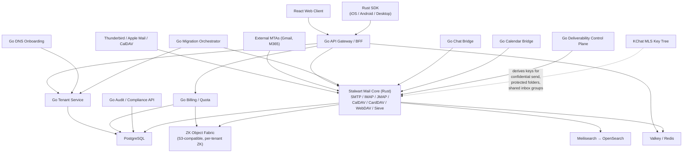
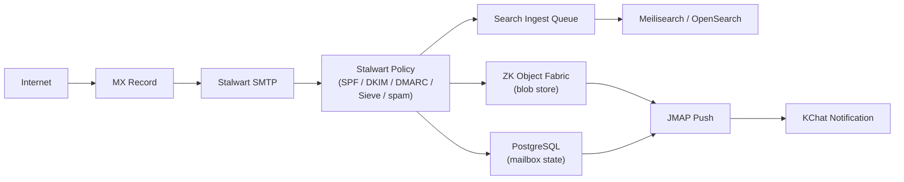
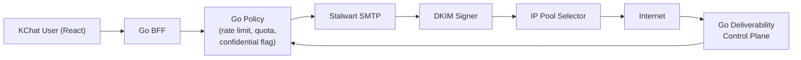
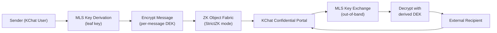
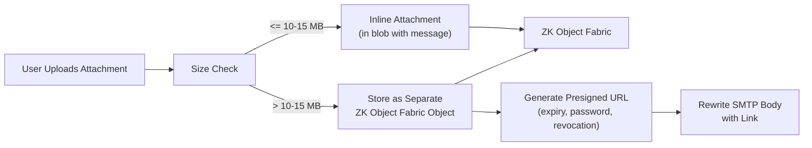
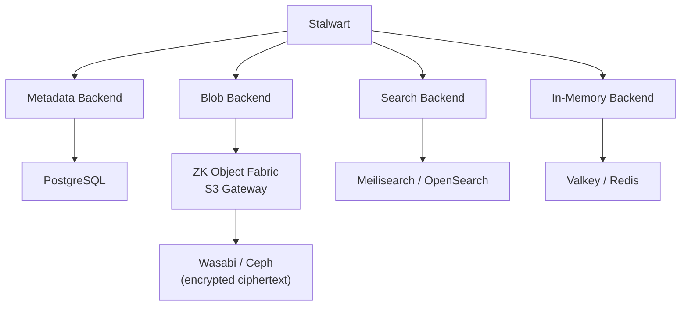
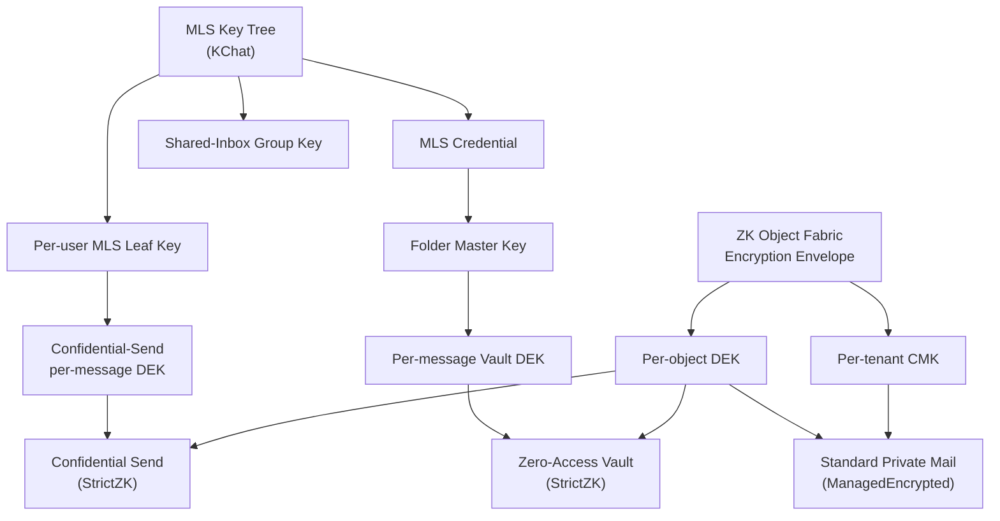
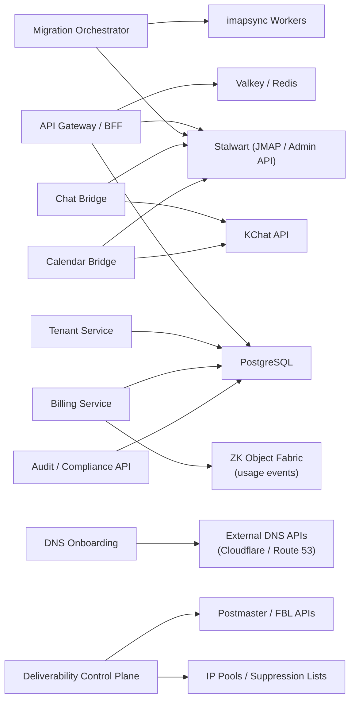
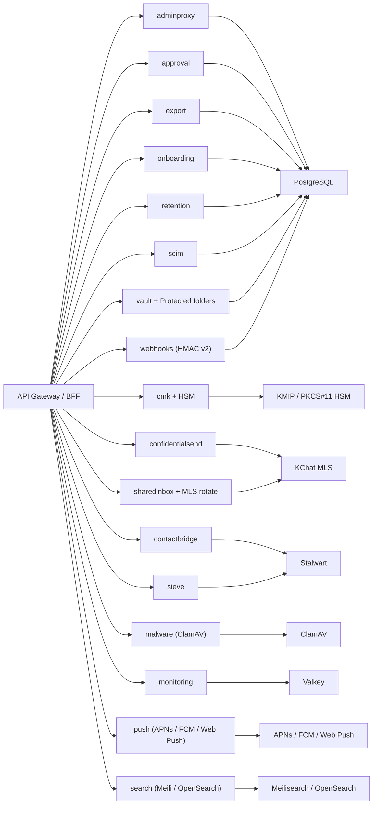

# KMail — Architecture

**License**: Proprietary — All Rights Reserved. See [LICENSE](../LICENSE).

> Status: Phases 1–5, 7–8 complete. Phase 6 — Enterprise Readiness
> (in progress; Exchange interop research and BIMI VMC issuance deferred).
> See [PROGRESS.md](PROGRESS.md) for the phase-gated tracker and
> [PHASES.md](PHASES.md) for the phase overview. For strategy,
> pricing, and the phased plan, see [PROPOSAL.md](PROPOSAL.md).

This document is the single source of truth for KMail's architecture.
It covers the system topology, three-layer integration model, data
flow diagrams, encryption architecture, multi-tenancy model, Go
service topology, protocol matrix, deployment architecture, and
search architecture.

---

## 1. System Overview

KMail is composed of five clear layers: a React client layer, a Go
control plane, the Stalwart (Rust) mail core, four storage systems,
and the zk-object-fabric blob fabric that sits underneath the blob
store. Each layer has a single responsibility and a stable contract
with the layer above and below.


```mermaid
flowchart TD
    WebClient["React Web Client"]
    NativeClient["Rust SDK<br/>(iOS / Android / Desktop)"]
    ThirdParty["Thunderbird / Apple Mail / CalDAV"]
    ExternalMTA["External MTAs (Gmail, M365)"]

    BFF["Go API Gateway / BFF"]
    Tenant["Go Tenant Service"]
    DNS["Go DNS Onboarding"]
    Migration["Go Migration Orchestrator"]
    ChatBridge["Go Chat Bridge"]
    CalendarBridge["Go Calendar Bridge"]
    Billing["Go Billing / Quota"]
    Deliverability["Go Deliverability Control Plane"]
    Audit["Go Audit / Compliance API"]

    Stalwart["Stalwart Mail Core (Rust)<br/>SMTP / IMAP / JMAP /<br/>CalDAV / CardDAV / WebDAV / Sieve"]

    Postgres["PostgreSQL"]
    ZKOF["ZK Object Fabric<br/>(S3-compatible, per-tenant ZK)"]
    Search["Meilisearch → OpenSearch"]
    Valkey["Valkey / Redis"]

    MLS["KChat MLS Key Tree"]

    WebClient --> BFF
    NativeClient --> BFF
    ThirdParty --> Stalwart
    ExternalMTA --> Stalwart

    BFF --> Stalwart
    BFF --> Tenant
    BFF --> Billing
    BFF --> Valkey
    Tenant --> Postgres
    DNS --> Tenant
    Migration --> Stalwart
    Migration --> Tenant
    ChatBridge --> Stalwart
    CalendarBridge --> Stalwart
    Billing --> Postgres
    Billing --> ZKOF
    Deliverability --> Stalwart
    Audit --> Postgres

    Stalwart --> Postgres
    Stalwart --> ZKOF
    Stalwart --> Search
    Stalwart --> Valkey

    MLS -.->|"derives keys for<br/>confidential send,<br/>protected folders,<br/>shared inbox groups"| Stalwart
```

---

## 2. Three-Layer Integration Model

KMail is the integration of three independently-owned systems. Each
layer has a well-defined contract; none of the three reinvents what
the others already provide.

### 2.1 KChat MLS Layer

- Provides: MLS group messaging, MLS credentials, per-user leaf
  keys, per-epoch group keys, forward secrecy, post-compromise
  security, efficient rekeying on membership change.
- Role in KMail: the **key hierarchy source**. All KMail encryption
  keys that are not managed by the zk-object-fabric gateway are
  derived from MLS material.
- Stable contract: MLS credential derivation API + shared-inbox
  MLS group membership API.

### 2.2 Stalwart Mail Core

- Provides: SMTP, IMAP, JMAP, CalDAV, CardDAV, WebDAV, Sieve
  filtering, spam/phishing scoring, multi-tenant mailbox
  management, OIDC.
- Role in KMail: the **protocol and mail-semantics layer**. Stalwart
  owns everything that is fundamentally about being a mail server —
  MIME, RFC 5322, SMTP retry queues, IMAP state, JMAP sync, CalDAV
  scheduling.
- Stable contract: Stalwart's configured storage backends
  (PostgreSQL for metadata, zk-object-fabric S3 for blobs,
  Meilisearch/OpenSearch for search, Valkey for in-memory state).

### 2.3 ZK Object Fabric Storage

- Provides: S3-compatible blob storage, per-tenant ZK encryption,
  content-addressed storage (BLAKE3 piece IDs), tiered caching
  (L0/L1/L2), pluggable backends (Wasabi, Ceph RGW, etc.),
  cloud-to-local migration, placement policies.
- Role in KMail: the **blob layer**. Every byte of mail content,
  attachment, and large calendar/contact object goes through
  zk-object-fabric.
- Stable contract: the zk-object-fabric S3-compatible API +
  `StorageProvider` interface + `EncryptionMode` envelope
  (`StrictZK`, `ManagedEncrypted`, `PublicDistribution`).

The union of these three layers is KMail. Any KMail-specific code
that tries to reimplement one of them is wrong.

---

## 3. Data Flow Diagrams

### 3.1 Inbound mail flow


```mermaid
flowchart LR
    Internet["Internet"]
    MX["MX Record"]
    StalwartSMTP["Stalwart SMTP"]
    Policy["Stalwart Policy<br/>(SPF / DKIM / DMARC /<br/>Sieve / spam)"]
    ZKOF["ZK Object Fabric<br/>(blob store)"]
    Postgres["PostgreSQL<br/>(mailbox state)"]
    SearchQueue["Search Ingest Queue"]
    Search["Meilisearch / OpenSearch"]
    JMAPPush["JMAP Push"]
    KChatNotif["KChat Notification"]

    Internet --> MX
    MX --> StalwartSMTP
    StalwartSMTP --> Policy
    Policy --> ZKOF
    Policy --> Postgres
    Policy --> SearchQueue
    SearchQueue --> Search
    ZKOF --> JMAPPush
    Postgres --> JMAPPush
    JMAPPush --> KChatNotif
```

### 3.2 Outbound mail flow


```mermaid
flowchart LR
    User["KChat User (React)"]
    BFF["Go BFF"]
    Policy["Go Policy<br/>(rate limit, quota,<br/>confidential flag)"]
    StalwartSMTP["Stalwart SMTP"]
    DKIM["DKIM Signer"]
    IPPool["IP Pool Selector"]
    Internet["Internet"]
    Deliverability["Go Deliverability<br/>Control Plane"]

    User --> BFF
    BFF --> Policy
    Policy --> StalwartSMTP
    StalwartSMTP --> DKIM
    DKIM --> IPPool
    IPPool --> Internet
    Internet --> Deliverability
    Deliverability --> Policy
```

### 3.3 Confidential send flow


```mermaid
flowchart LR
    Sender["Sender (KChat User)"]
    MLS["MLS Key Derivation<br/>(leaf key)"]
    Encrypt["Encrypt Message<br/>(per-message DEK)"]
    ZKOFStrict["ZK Object Fabric<br/>(StrictZK mode)"]
    Portal["KChat Confidential Portal"]
    KeyExchange["MLS Key Exchange<br/>(out-of-band)"]
    Recipient["External Recipient"]
    Decrypt["Decrypt with<br/>derived DEK"]

    Sender --> MLS
    MLS --> Encrypt
    Encrypt --> ZKOFStrict
    ZKOFStrict --> Portal
    Recipient --> Portal
    Portal --> KeyExchange
    KeyExchange --> Decrypt
    Decrypt --> Recipient
```

### 3.4 Attachment upload flow


```mermaid
flowchart LR
    Upload["User Uploads Attachment"]
    SizeCheck["Size Check"]
    Inline["Inline Attachment<br/>(in blob with message)"]
    LinkObject["Store as Separate<br/>ZK Object Fabric Object"]
    Presign["Generate Presigned URL<br/>(expiry, password, revocation)"]
    Rewrite["Rewrite SMTP Body<br/>with Link"]
    ZKOF["ZK Object Fabric"]

    Upload --> SizeCheck
    SizeCheck -->|"<= 10-15 MB"| Inline
    SizeCheck -->|"> 10-15 MB"| LinkObject
    Inline --> ZKOF
    LinkObject --> ZKOF
    LinkObject --> Presign
    Presign --> Rewrite
```

---

## 4. Storage Architecture

Stalwart is configured with four storage backends, one per concern.
Each backend has a stable contract with Stalwart, and each maps to a
single physical system in the KMail deployment.


```mermaid
flowchart TD
    Stalwart["Stalwart"]
    Meta["Metadata Backend"]
    Blob["Blob Backend"]
    SearchBackend["Search Backend"]
    InMem["In-Memory Backend"]

    Postgres["PostgreSQL"]
    ZKOFGw["ZK Object Fabric<br/>S3 Gateway"]
    Wasabi["Wasabi / Ceph<br/>(encrypted ciphertext)"]
    Meili["Meilisearch / OpenSearch"]
    Valkey["Valkey / Redis"]

    Stalwart --> Meta
    Stalwart --> Blob
    Stalwart --> SearchBackend
    Stalwart --> InMem

    Meta --> Postgres
    Blob --> ZKOFGw
    ZKOFGw --> Wasabi
    SearchBackend --> Meili
    InMem --> Valkey
```

- **Data store (metadata) → PostgreSQL**. Tenant metadata, users,
  domains, mailbox state, calendar metadata, quotas. Small rows,
  transactional.
- **Blob store → zk-object-fabric S3 gateway → Wasabi / Ceph**. Raw
  RFC 5322 messages, attachments, large calendar/contact objects.
  Ciphertext only; plaintext never lands in Wasabi or Ceph.
- **Search store → Meilisearch (MVP) / OpenSearch (scale)**. Indexed
  message text, attachment text (when server-visible), subject /
  from / to, calendar search. Tenant-isolated indexes.
- **In-memory store → Valkey / Redis**. Sessions, rate limits, auth
  tokens, queue hints, transient counters.

Both Stalwart's blob store and zk-object-fabric use BLAKE3 for
content addressing; that alignment avoids a redundant
content-addressing step at the KMail layer.

---

## 5. Encryption Architecture


```mermaid
flowchart TD
    MLSTree["MLS Key Tree<br/>(KChat)"]
    LeafKey["Per-user MLS Leaf Key"]
    Credential["MLS Credential"]
    GroupKey["Shared-Inbox Group Key"]

    ConfidentialDEK["Confidential-Send<br/>per-message DEK"]
    FolderKey["Folder Master Key"]
    VaultDEK["Per-message Vault DEK"]

    ZKOFEnvelope["ZK Object Fabric<br/>Encryption Envelope"]
    ObjectDEK["Per-object DEK"]
    TenantCMK["Per-tenant CMK"]

    Standard["Standard Private Mail<br/>(ManagedEncrypted)"]
    Confidential["Confidential Send<br/>(StrictZK)"]
    Vault["Zero-Access Vault<br/>(StrictZK)"]

    MLSTree --> LeafKey
    MLSTree --> Credential
    MLSTree --> GroupKey

    LeafKey --> ConfidentialDEK
    Credential --> FolderKey
    FolderKey --> VaultDEK

    ZKOFEnvelope --> ObjectDEK
    ZKOFEnvelope --> TenantCMK

    ObjectDEK --> Standard
    TenantCMK --> Standard

    ConfidentialDEK --> Confidential
    ObjectDEK --> Confidential

    VaultDEK --> Vault
    ObjectDEK --> Vault
```

Summary of the three encryption paths:

- **Standard Private Mail** — zk-object-fabric `ManagedEncrypted`
  wraps the blob. Per-tenant CMK protects per-object DEKs. No MLS
  involvement; the gateway manages keys.
- **Confidential Send** — zk-object-fabric `StrictZK` wraps the
  blob. An MLS-derived per-message DEK wrapping key unlocks the
  envelope; recipients in KChat derive it from MLS membership,
  external recipients use the portal flow.
- **Zero-Access Vault** — zk-object-fabric `StrictZK` wraps the
  blob. A folder master key (derived from the user's MLS
  credential) protects per-message DEKs. The server never sees
  plaintext.

---

## 6. Multi-Tenancy Model

Tenant isolation is enforced in three places, each with its own
scope:

1. **Go control plane**. Every Go service carries a tenant ID
   through the call stack. Every PostgreSQL query is tenant-scoped.
   Every background job is tenant-scoped. Cross-tenant operations
   require an explicit operator role and are logged.
2. **Stalwart**. Stalwart's multi-tenancy provides per-tenant
   mailbox namespaces, per-tenant quotas, and per-tenant domain
   isolation.
3. **zk-object-fabric**. Per-tenant CMK and per-tenant bucket
   namespace. Content-addressed dedupe is scoped inside the tenant
   bucket — it never crosses tenant boundaries, so hash collisions
   cannot leak content presence across tenants.

Specifically:

- **Per-tenant encryption keys** — a zk-object-fabric CMK per
  tenant.
- **Per-tenant blob namespaces** — a zk-object-fabric bucket per
  tenant.
- **Per-tenant quotas, rate limits, IP pools** — enforced at the
  Go control plane and Stalwart.
- **Per-tenant audit log** — every tenant-affecting action is
  recorded in the audit API.

---

## 7. Go Service Topology


```mermaid
flowchart LR
    BFF["API Gateway / BFF"]
    TenantSvc["Tenant Service"]
    DNSSvc["DNS Onboarding"]
    MigrationSvc["Migration Orchestrator"]
    ChatBridgeSvc["Chat Bridge"]
    CalendarBridgeSvc["Calendar Bridge"]
    BillingSvc["Billing Service"]
    DeliverabilitySvc["Deliverability Control Plane"]
    AuditSvc["Audit / Compliance API"]

    Stalwart["Stalwart (JMAP / Admin API)"]
    Postgres["PostgreSQL"]
    Valkey["Valkey / Redis"]
    ZKOF["ZK Object Fabric<br/>(usage events)"]
    KChat["KChat API"]
    ImapsyncWorkers["imapsync Workers"]
    ExternalDNS["External DNS APIs<br/>(Cloudflare / Route 53)"]
    PostmasterAPIs["Postmaster / FBL APIs"]
    IPPools["IP Pools / Suppression Lists"]

    BFF --> Stalwart
    BFF --> Postgres
    BFF --> Valkey

    TenantSvc --> Postgres

    DNSSvc --> ExternalDNS

    MigrationSvc --> ImapsyncWorkers
    MigrationSvc --> Stalwart

    ChatBridgeSvc --> KChat
    ChatBridgeSvc --> Stalwart

    CalendarBridgeSvc --> Stalwart
    CalendarBridgeSvc --> KChat

    BillingSvc --> Postgres
    BillingSvc --> ZKOF

    DeliverabilitySvc --> IPPools
    DeliverabilitySvc --> PostmasterAPIs

    AuditSvc --> Postgres
```

Summary:

- **API Gateway / BFF** → Stalwart (JMAP), PostgreSQL, Valkey.
- **Tenant Service** → PostgreSQL.
- **DNS Onboarding** → external DNS provider APIs.
- **Migration Orchestrator** → imapsync workers, Stalwart.
- **Chat Bridge** → KChat API, Stalwart.
- **Calendar Bridge** → Stalwart CalDAV, KChat API.
- **Billing Service** → PostgreSQL, zk-object-fabric usage events.
- **Deliverability Control Plane** → IP pools, suppression lists,
  Postmaster APIs.
- **Audit / Compliance API** → PostgreSQL.

### 7.1 Extended Service Map

The diagram above shows the original Phase 1–2 service set. Phases
3–8 added a second layer of focused control-plane packages that
share the same BFF process and Postgres instance. Each package owns
a single concern, has its own RLS-scoped tables (where applicable),
and registers its routes under `/api/v1/...`.

The full list of Go packages under `internal/` (28 total):

| Package              | Concern                                                                    | Backed by                                          |
| -------------------- | -------------------------------------------------------------------------- | -------------------------------------------------- |
| `adminproxy/`        | Reverse access proxy for SRE reads of tenant data (approval-gated, audited)| `admin_access_sessions`, `audit`                    |
| `approval/`          | Admin access approval workflow (per-action gating, executor registry)      | `approval_requests`, `approval_config`              |
| `audit/`             | Hash-chained audit log + verify + JSON/CSV export                          | `audit_log`                                         |
| `billing/`           | Quota / seat accounting, plan enforcement, Stripe lifecycle, dunning       | `billing_*`, `quotas`, `billing_subscriptions`     |
| `calendarbridge/`    | CalDAV bridge, KChat scheduling, reminders, free/busy, sharing             | Stalwart CalDAV + KChat API + Valkey               |
| `chatbridge/`        | KChat ↔ email bridge (notifications, routing, threading)                   | Stalwart + KChat API + `chat_bridge_routes`        |
| `cmk/`               | Customer-managed keys (PEM upload, KMIP / PKCS#11 HSM envelope ops)        | `customer_managed_keys`, `cmk_hsm_configs`         |
| `confidentialsend/`  | Confidential Send portal + MLS-derived envelope keys                       | `confidential_send_links` + KChat MLS               |
| `contactbridge/`     | CardDAV bridge + tenant-wide global address list                           | Stalwart CardDAV + `gal_entries`                    |
| `deliverability/`    | IP pools, warmup, suppression, bounce, DMARC, FBL, abuse, alerts           | `ip_pools`, `suppression_list`, `dmarc_reports`, … |
| `dns/`               | DNS onboarding, autoconfig / autodiscover, DKIM rotation                   | `tenant_domains`, `tenant_dns_records`, `dkim_keys`|
| `export/`            | Worker-pool eDiscovery export jobs (mbox / eml / pst stub)                 | `export_jobs`                                       |
| `jmap/`              | JMAP proxy, shard-aware routing, attachment-to-link, malware pre-hook      | Stalwart JMAP + `attachment_links`                 |
| `malware/`           | Malware scanning adapter (NoopScanner default, ClamAV INSTREAM)            | optional ClamAV TCP endpoint                       |
| `middleware/`        | OIDC, RLS GUC, metrics, tracing, Loki log shipping, WebAuthn / TOTP        | Postgres + OTEL + Valkey                           |
| `migration/`         | IMAP / Gmail / M365 migration orchestrator + staged sync + test-connection | `migration_jobs` + imapsync                         |
| `monitoring/`        | SLO tracker + multi-region aggregator + degradation middleware             | Valkey-backed sorted sets                          |
| `onboarding/`        | Guided onboarding checklist + auto-triggers from webhook events            | `onboarding_steps`, `onboarding_auto_triggers`     |
| `push/`              | Push notifications (TransportRouter → APNs / FCM / Web Push / dev log)     | `push_subscriptions`, `notification_preferences`   |
| `retention/`         | Retention / archive policy CRUD + 24 h evaluation worker                   | `retention_policies`                                |
| `scim/`              | SCIM 2.0 provisioning (`/scim/v2/Users` + `/scim/v2/Groups`) + discovery   | `scim_tokens`                                       |
| `search/`            | Per-tenant search backend abstraction (Meilisearch / OpenSearch) + reindex | `search_backend` column                             |
| `sharedinbox/`       | Shared-inbox workflows (assign / note / status) + MLS group key rotation   | `shared_inbox_*` tables + KChat MLS                |
| `sieve/`             | Per-tenant Sieve rule CRUD + validate + deploy                             | `sieve_rules`                                       |
| `tenant/`            | Tenant lifecycle, shards, storage placement, billing lifecycle hooks       | `tenants`, `users`, `tenant_storage_credentials`   |
| `vault/`             | Zero-Access Vault folders + Protected folders + access log                 | `vault_folders`, `protected_folders`                |
| `webhooks/`          | Tenant outbound webhooks with HMAC v1 + v2 signing (timestamp + nonce)     | `webhook_endpoints`, `webhook_deliveries`           |

`/jmap` and `/scim/v2/...` are the only routes outside the
`/api/v1/...` REST namespace; both are required by their respective
RFCs.


```mermaid
flowchart LR
    BFF["API Gateway / BFF"]
    AdminProxy["adminproxy"]
    Approval["approval"]
    CMK["cmk + HSM"]
    ConfidentialSend["confidentialsend"]
    ContactBridge["contactbridge"]
    Export["export"]
    Malware["malware (ClamAV)"]
    Monitoring["monitoring"]
    Onboarding["onboarding"]
    Push["push (APNs / FCM / Web Push)"]
    Retention["retention"]
    SCIM["scim"]
    Search["search (Meili / OpenSearch)"]
    SharedInbox["sharedinbox + MLS rotate"]
    Sieve["sieve"]
    Vault["vault + Protected folders"]
    Webhooks["webhooks (HMAC v2)"]

    Postgres["PostgreSQL"]
    Valkey["Valkey"]
    Stalwart["Stalwart"]
    KChatMLS["KChat MLS"]
    HSM["KMIP / PKCS#11 HSM"]
    ClamAV["ClamAV"]
    SearchEngine["Meilisearch / OpenSearch"]
    PushProviders["APNs / FCM / Web Push"]

    BFF --> AdminProxy --> Postgres
    BFF --> Approval --> Postgres
    BFF --> CMK --> HSM
    BFF --> ConfidentialSend --> KChatMLS
    BFF --> ContactBridge --> Stalwart
    BFF --> Export --> Postgres
    BFF --> Malware --> ClamAV
    BFF --> Monitoring --> Valkey
    BFF --> Onboarding --> Postgres
    BFF --> Push --> PushProviders
    BFF --> Retention --> Postgres
    BFF --> SCIM --> Postgres
    BFF --> Search --> SearchEngine
    BFF --> SharedInbox --> KChatMLS
    BFF --> Sieve --> Stalwart
    BFF --> Vault --> Postgres
    BFF --> Webhooks --> Postgres
```

The mermaid diagram is intentionally abbreviated — every package
also reads/writes Postgres for its own tables and emits events via
`audit.Service` where applicable. The originals (BFF, Tenant,
DNS, Migration, ChatBridge, CalendarBridge, Billing, Deliverability,
Audit) remain the trunk; the extended map above are leaves on that
trunk that share the same Postgres connection pool, Valkey client,
and OIDC/RLS middleware stack.

---

## 8. Protocol Matrix

| Client                         | Protocol              | Notes                                                           |
| ------------------------------ | --------------------- | --------------------------------------------------------------- |
| KChat web app                  | JMAP through Go BFF   | Primary UX path.                                                |
| KChat iOS / Android            | JMAP via Rust SDK     | Cross-platform `kmail-sdk` (UniFFI) + APNs / FCM push.          |
| KChat desktop (Electron)       | JMAP via Rust SDK     | Same `kmail-sdk` via napi-rs; macOS / Windows / Linux.          |
| Thunderbird                    | IMAP / SMTP           | Third-party compatibility.                                      |
| Apple Mail (macOS / iOS)       | IMAP / SMTP / CalDAV  | Third-party compatibility.                                      |
| Outlook (desktop)              | IMAP / SMTP           | No MAPI or Exchange interop in Phase 2–4.                       |
| Calendar clients (Apple, GNOME)| CalDAV                | Personal and shared calendars.                                  |
| Contacts clients (Apple)       | CardDAV               | Personal and shared address books.                              |
| Admin UI                       | Go Admin API          | Tenant console backend.                                         |
| External MTAs                  | SMTP (port 25)        | Standard Internet mail.                                         |

JMAP is the primary client strategy because it is efficient over
mobile networks, supports push, maps naturally to the KChat UI's
rendering model, and avoids the IMAP state-machine impedance
mismatch.

---

## 9. Deployment Architecture

- **Multi-tenant shards, not per-SME stacks**. A shard hosts many
  tenants behind the same Stalwart cluster; per-SME stacks are
  reserved for dedicated-enterprise customers.
- **1 shard = 3 mail nodes + external DB + external search +
  external cache + external object storage (zk-object-fabric)**.
  Mail nodes run Stalwart; every other component is a managed
  service (PostgreSQL, Meilisearch/OpenSearch, Valkey, zk-object-
  fabric).
- **5,000–10,000 active mailboxes per shard (conservative)**.
  Horizontal scaling adds shards; shards do not share mail state.
- **SMTP needs stable IPs, reverse DNS, reputation**. Mail nodes
  live on VMs or dedicated servers with stable public IPs, valid
  PTR records, and IP addresses registered for each sending pool.
- **Go services on Kubernetes; Stalwart on VMs / dedicated
  servers**. The control plane autoscales and rolls out from a
  GitOps pipeline; Stalwart runs on long-lived hosts with explicit
  IP reputation, SPF alignment, and planned maintenance windows.
- **Helm chart at `deploy/helm/kmail/`**. Ships a `kmail-api`
  Deployment + Service + Ingress + ConfigMap + Secret + HPA + PDB
  for the Go BFF, and a Stalwart StatefulSet (with stable per-pod
  hostnames so SMTP PTR records line up). `make helm-lint`
  validates the chart in CI; the chart is the production deploy
  target — `docker compose up` is for local dev only.
- **Observability stack — Loki + Promtail + Grafana**, behind the
  `loki` compose profile (`docker compose --profile loki up`).
  Promtail tails the Stalwart and BFF JSON request logs and ships
  them into Loki; Grafana auto-loads the
  `deploy/grafana/datasources.yml` Loki datasource and the
  `deploy/grafana/dashboards/{kmail-overview,kmail-deliverability}.json`
  dashboards on first boot.
- **Prometheus scrape config at `deploy/prometheus/prometheus.yml`**
  scrapes `/metrics` on the BFF (request latency, error rate, JMAP
  / SCIM / SMTP rates, deliverability counters, SLO gauges, dunning
  events, retention runs, malware-scan outcomes). The
  `KMail Overview` dashboard renders the SLO targets from
  PROPOSAL.md against this scrape.
- **ClamAV malware scanning** ships behind the `clamav` compose
  profile (`docker compose --profile clamav up`). The
  `internal/malware` adapter speaks INSTREAM over TCP and is wired
  as a JMAP submit-time pre-delivery hook in `internal/jmap`. When
  the profile is off the scanner falls through to a `NoopScanner`
  so dev stacks don't hard-depend on ClamAV.
- **Pre-built Grafana dashboards** at
  `deploy/grafana/dashboards/`:
    - `kmail-overview.json` — SLO compliance, request latency,
      error rate, shard health, queue depths.
    - `kmail-deliverability.json` — IP reputation, bounce / FBL /
      DMARC pass rates, suppression growth, abuse-score outliers.
- **Secrets / env**. The BFF reads its config from environment
  variables (database URL, OIDC issuer, KChat API token,
  zk-object-fabric credentials, Stripe keys, VAPID keys, ClamAV
  address, optional CMK / KMIP / PKCS#11 paths). The Helm chart
  surfaces these via `values.yaml` keys + a Kubernetes Secret; the
  compose stack reads them from `.env`.
- **CI / CD**. `.github/workflows/ci.yml` runs Go 1.25 `make tidy
  / vet / build / test` (with `-race`) on every push and PR, and
  `npm ci && npm run build` for the React app. The Helm chart is
  validated in the same job via `make helm-lint`.

---

## 9.1 Repository Layout

The repo is laid out so each top-level directory maps to exactly
one architectural concern from the section above:

```
kmail/
├── api/              # API documentation (openapi / spec)
├── cmd/              # Go entrypoint binaries (9 services)
├── configs/          # Stalwart bootstrap config
├── deploy/           # Helm, Grafana, Loki, Promtail, Prometheus, Stalwart HA
├── docs/             # All project documentation
├── internal/         # Go packages (28 packages — see §7.1)
├── migrations/       # PostgreSQL squashed baseline (001_baseline.sql)
├── scripts/          # Init, test, bench, load, chaos scripts
├── sdk/              # Rust SDK workspace (kmail-core / kmail-ffi /
│                     # kmail-napi / kmail-cli). Powers the iOS,
│                     # Android, and Electron desktop clients via
│                     # UniFFI + napi-rs bindings — see §10.
├── web/              # React frontend (TypeScript + Vite)
├── docker-compose.yml
├── Dockerfile
├── Makefile
└── go.mod
```

- `cmd/` — small entrypoints that wire `internal/` packages into a
  long-running binary. The primary one is `cmd/kmail-api/`; the
  others (worker / migrations / dev tooling) follow the same
  pattern.
- `configs/` — Stalwart's TOML config, generated migrations for
  the dev tenant, and the per-shard bootstrap files.
- `deploy/` — `helm/kmail/` (chart + values + templates),
  `grafana/dashboards/` + `grafana/provisioning/`, `loki/`,
  `promtail/`, `prometheus/`, `stalwart-ha/` (per-shard HA template).
- `migrations/` — single squashed Postgres baseline schema
  (`001_baseline.sql`) covering all RLS-scoped tables, indexes,
  policies, triggers, and functions. Applied via
  `scripts/migrate.sh` on first boot of `cmd/kmail-api/`; future
  schema changes land as new additive numbered files.
- `scripts/` — `test-e2e.sh`, `test-scim.sh`, `test-imap-smtp.sh`,
  `test-caldav.sh`, `test-stalwart-upgrade.sh`,
  `loadtest/load-jmap.go`, `load-smtp.sh`, `chaos-shard.sh`,
  `chaos-postgres.sh`, `chaos-valkey.sh`, `bench/`,
  `capture-screenshots.mjs`, `init-zk-bucket.sh`,
  `stalwart-init*.sh`. All wrapped by Makefile targets.
- `web/` — Vite + TypeScript + React Router. `src/api/` mirrors
  the BFF's REST surface; `src/pages/` hosts the Mail / Calendar
  / Contacts / Admin views; `src/types/` carries the shared types
  generated from JMAP shapes.

---

## 10. Client SDK Architecture

The iOS, Android, and Electron desktop KMail clients all share a
single Rust implementation — the `kmail-sdk` workspace under
`sdk/`. Native shells are thin presentation layers; every piece
of protocol state, every byte of crypto, and the entire offline
cache live in Rust.

### 10.1 Layering

```
┌───────────────────────────────────────────────────┐
│  Swift UI (iOS)   Jetpack Compose (Android)   Electron + React  │
└───┬────────────────┬──────────────────────────┬────────┘
    │ UniFFI Swift   │ UniFFI Kotlin              │ napi-rs
┌───┴────────────────┴──────────────────────────┴────────┐
│  kmail-ffi (UniFFI proc-macros)        kmail-napi (N-API)        │
└──────────────────────────┬────────────────────────────────┘
                          │
┌────────────────────────┴────────────────────────────────┐
│ kmail-core                                                       │
│   models   error   crypto (AES-256-GCM / HKDF / KeyStore)        │
│   sync     cache   push (APNs / FCM / WebPush)                   │
│   jmap (transport / request / response / ops / client)           │
│   KMailClient façade (sync, fetch, send, register, decrypt)      │
└──────────────────────────────────────────────────────┘
                          │ reqwest (rustls) / rusqlite
               ┌────────┴───────────┐
               │  Go BFF → Stalwart  │
               └───────────────────┘
```

### 10.2 Crate responsibilities

| Crate            | Owns                                                                                                           |
| ---------------- | -------------------------------------------------------------------------------------------------------------- |
| `kmail-core`     | JMAP transport, request/response codecs, typed ops, offline sync engine, crypto primitives, push, blob cache. |
| `kmail-ffi`      | UniFFI proc-macro bindings (`#[uniffi::Object]`, `#[uniffi::Record]`, `#[uniffi::Error]`) producing Swift + Kotlin packages. |
| `kmail-napi`     | napi-rs bindings (`#[napi]`) producing a Node-API module consumed by the Electron desktop shell.              |
| `kmail-cli`      | Internal debug CLI (`session`, `sync`, `mailboxes`, `emails`, `email`, `doctor`) that drives `KMailClient` directly against a real BFF. |

### 10.3 Delta-pull sync

First sync → `Mailbox/get` → `Email/query` (newest window) →
`Email/get` (hydrate) → `Email/get` with empty `ids` to read the
canonical Email state token. Subsequent syncs → `Mailbox/get` for
the mailbox tree (cheap) and `Email/changes` against the saved
state token. When the BFF surfaces `cannotCalculateChanges`, the
SDK drops the stale token and re-bootstraps via the initial path
automatically. All state tokens, mailboxes, emails, blob cache,
and pending offline actions live in a per-account SQLite database
opened at the path the platform shell supplies.

### 10.4 Encryption boundary

- AES-256-GCM and HKDF-SHA256 live in `kmail-core::crypto`; both
  are verified against the NIST CAVS GCM vectors and the RFC 5869
  HKDF test vectors at build time.
- The MLS leaf key is supplied by the platform shell through the
  `KeyStore` trait; the iOS shell bridges to Keychain Services,
  the Android shell to the Android Keystore, and the desktop
  shell to the OS keyring (Secret Service / Keychain / Credential
  Manager).
- Per-folder DEKs derive from the MLS leaf key + folder label via
  HKDF; per-message DEKs derive from the folder DEK + message ID.
  The derivation matches §5 "Encryption Architecture".

### 10.5 Build / distribution

- iOS: `cargo build` for `aarch64-apple-ios` + simulator triples;
  UniFFI emits the Swift package; XCFramework is bundled in the
  iOS shell repo (follow-up workstream).
- Android: `cargo build` for the four Android NDK triples; UniFFI
  emits Kotlin bindings; the shell consumes them through a
  Gradle module.
- Desktop: `napi build` produces platform-specific `.node`
  binaries; Electron loads them through `@kmail/sdk-native`.
- CI is wired into `.github/workflows/ci.yml` under the `sdk`
  job (fmt + clippy + test + release build); per-platform
  cross-compile sweeps are added in follow-up PRs.

---

## 11. Search Architecture

Tiered search keeps the common case fast and the rare case
possible:

- **Core tier** — headers + recent body (last 90 days). Default for
  all mailboxes. Indexed in Meilisearch.
- **Pro tier** — full mailbox indexed. Available on KChat Mail Pro
  and above.
- **Archive tier** — cold-storage search for retention/archive.
  Slower, on-demand reindexing.
- **Privacy vault tier** — **no server-side search**. Zero-Access
  Vault folders are not indexed; clients perform local search after
  decryption.

Infrastructure:

- **Meilisearch for MVP**. Small, easy to operate, excellent
  relevance out of the box at SME scale.
- **OpenSearch for scale**. Cut over when a tenant crosses a size
  threshold or when cluster operations demand OpenSearch's
  distributed tooling.
- **Tenant-isolated indexes**. Every index is scoped by tenant; no
  cross-tenant queries.
