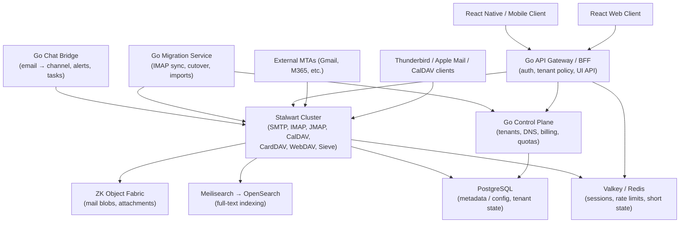

# KMail — Technical Proposal

**License**: Proprietary — All Rights Reserved. See [LICENSE](../LICENSE).

> Status: Phase 1 — Foundation (in progress). This document defines the
> target architecture, not the current implementation. See
> [PROGRESS.md](PROGRESS.md) for build status.

---

## 1. Executive Summary

- **What**: KMail is a privacy-centric email and calendar service
  embedded in KChat B2B. Custom-domain email, shared inboxes, team
  calendar, and migration for SMEs, delivered inside the KChat
  workspace.
- **Core stack**:
  - **Stalwart (Rust)** — the mail and collaboration core. Handles
    SMTP, IMAP, JMAP, CalDAV, CardDAV, WebDAV, Sieve filtering, and
    spam/phishing scoring. Pinned to
    [v0.16.0](https://github.com/stalwartlabs/mail-server/releases/tag/v0.16.0)
    (April 20, 2026); v1.0.0 expected H1 2026.
  - **Go control plane** — tenant provisioning, DNS onboarding,
    admin BFF, migration orchestration, KChat chat bridge, calendar
    bridge, billing, deliverability, audit.
  - **React frontend** — native KChat Mail and Calendar UI.
- **Storage**: supplied by
  [zk-object-fabric](https://github.com/kennguy3n/zk-object-fabric),
  the same ZK object storage fabric used across KChat. Mail blobs,
  attachments, and large calendar/contact objects live behind
  zk-object-fabric's S3-compatible gateway with per-tenant
  ZK encryption, content-addressed deduplication (tenant-scoped
  only), and tiered caching (L0/L1/L2).
- **Encryption**: KChat's MLS (Messaging Layer Security) key tree
  extends to email. MLS-derived keys wrap confidential-send
  envelopes, unlock protected folders, and key shared-inbox groups.
  Nothing in KMail reinvents key management.
- **Target**: thousands of 5–100 seat SMEs at a direct infra cost of
  $0.25–$0.60 / user / month, supporting retail pricing tiers at
  $3–$9 / user / month.
- **Positioning**: "private business communication inside KChat" —
  not "cheaper Gmail." KMail is an ARPU and retention expansion
  layer inside KChat B2B, not a standalone mailbox product.

### 1.1 Tech stack summary

- **Mail core**: Stalwart (Rust).
- **Backend**: Go — one language for all control-plane services.
- **Frontend**: React + TypeScript — native KChat surface.
- **Metadata**: PostgreSQL.
- **Blob storage**: zk-object-fabric (S3-compatible).
- **Search**: Meilisearch at SME scale, OpenSearch for scale-out.
- **Cache / state**: Valkey / Redis.
- **Migration**: Go orchestrator wrapping
  [imapsync](https://github.com/imapsync/imapsync).

---

## 2. Strategy Assessment

### 2.1 Positioning

- KMail is **NOT** "cheaper Gmail." That is a losing frame — it
  competes on price against a free-at-the-margin product that has
  twenty years of deliverability reputation and brand recognition.
- KMail **IS** "private business communication inside KChat: email,
  shared inboxes, calendar, and chat in one low-cost SME
  workspace." The product exists because KChat already owns the
  tenant relationship, the identity provider, the audit surface, and
  the billing contract. Email and calendar are a retention and ARPU
  expansion layer on top of that contract.
- The implication for every architecture decision that follows: if a
  design choice strengthens KMail as a standalone product at the
  expense of its integration with KChat, it is the wrong choice.
  Integration wins over standalone parity.

### 2.2 Product wedge

- **Best fit**: 5–100 seat SMEs, service businesses (agencies, law
  firms, accounting practices, clinics, design studios),
  privacy-conscious firms, and existing KChat teams. This is where
  KChat's workflow value compounds with email in a way Google
  Workspace and Microsoft 365 cannot match.
- **Avoid early**: high-volume cold outbound senders (destroy IP
  reputation), large regulated enterprises with binding BAA / SEC
  17a-4 WORM / FINRA retention requirements (huge compliance surface
  area), and Microsoft-Exchange-dependent organizations (ActiveSync
  and Exchange calendaring are their own product).
- Those "avoid early" segments are not permanently excluded; they
  are simply not the Phase 2–4 wedge.

### 2.3 Privacy positioning

KMail is **privacy-centric by default**, but **not fully Proton-
style zero-access by default**. This distinction matters.

Baseline privacy posture:

- No ads.
- No content mining for training, profiling, or analytics.
- TLS everywhere on the wire.
- Strong auth (OIDC + WebAuthn / FIDO2 by default).
- Tenant isolation enforced at control plane, Stalwart, and
  zk-object-fabric.
- Encryption at rest via zk-object-fabric's per-tenant CMK.
- Admin audit logs for every tenant-affecting action.

Three privacy modes (covered in detail in §3 and §10):

- **Standard Private Mail** — default SME email. Server-side search
  and spam filtering are fully available. Encryption at rest uses
  zk-object-fabric `ManagedEncrypted`.
- **Confidential Send** — per-message. External recipients open the
  message through an encrypted KChat portal; envelope wrapping keys
  are derived from the sender's MLS leaf key. Supports expiry,
  password, and revocation.
- **Zero-Access Vault** — opt-in premium folders. Client-side
  encrypted via zk-object-fabric `StrictZK`; no server-side search
  on vault contents; folder master key derived from the user's MLS
  credential.

Do **NOT** make every mailbox zero-knowledge on day one. The cost
of that decision is very high and hits seven independent systems:

1. Spam scanning loses access to message bodies.
2. Server-side search becomes impossible without client decryption.
3. IMAP clients cannot perform server-side search.
4. Calendar invitations cannot be parsed server-side.
5. IMAP migration from Gmail / Microsoft 365 becomes much slower
   (requires per-message client-side re-encrypt).
6. Admin recovery (user leaves, password lost) becomes impossible
   without escrow.
7. Mobile push notifications cannot show message previews.

Privacy is a spectrum, not a switch. KMail lets the tenant and
individual user pick their point on the spectrum per-message and
per-folder.

---

## 3. MLS & ZK Object Fabric Encryption Synergy

This is the **key architectural insight** of the proposal: KMail's
encryption model is not new. It is the union of two existing
systems — KChat's MLS key tree and zk-object-fabric's encryption
envelope — with well-defined boundaries between them.

### 3.1 KChat MLS key hierarchy extension

KChat uses [MLS](https://datatracker.ietf.org/doc/rfc9420/) for
group messaging encryption. MLS provides:

- A tree-based key schedule that derives per-epoch group keys.
- Per-user leaf keys and MLS credentials (the user's long-term
  identity).
- Forward secrecy and post-compromise security on epoch rotation.
- Efficient rekeying as group membership changes.

KMail extends that tree in three places:

1. **Confidential-send envelope wrapping keys**.
   - Sender's MLS leaf key + recipient's MLS credential →
     Diffie-Hellman → per-message DEK wrapping key.
   - The wrapped DEK is stored on the confidential-send object in
     zk-object-fabric. The recipient opens the envelope by deriving
     the same key from their own MLS membership.
   - External recipients (outside KChat) use a portal flow that
     performs an out-of-band MLS key exchange; see §3.3 for the
     Confidential Send data flow.
2. **Protected-folder encryption keys**.
   - User's MLS credential → folder master key (per-folder salt).
   - Folder master key wraps per-message DEKs stored on zk-object-
     fabric blobs.
   - Folder migration between devices is an MLS credential operation,
     not a separate backup flow.
3. **Shared-inbox group keys**.
   - A shared inbox (`sales@`, `support@`, `info@`) is mapped to an
     MLS group. Current members of that MLS group can decrypt the
     shared inbox.
   - Adding or removing a user from the shared inbox triggers an
     MLS epoch change.
   - Ex-members cannot read messages received after their removal.

This unifies the encryption key lifecycle across chat and email.
There is no separate email-only key hierarchy; KMail does not issue
its own long-term keys. A user's cryptographic identity is their
KChat MLS credential.

### 3.2 ZK Object Fabric as mail blob store

Mail blobs (raw RFC 5322 messages) and attachments are stored as
objects in zk-object-fabric. Concretely:

- Stalwart's blob store backend is configured to write to
  zk-object-fabric's S3-compatible endpoint. Stalwart speaks S3 —
  that is the native API contract.
- zk-object-fabric provides:
  - S3-compatible API (PUT / GET / HEAD / DELETE / LIST,
    multipart, range reads, presigned URLs).
  - Per-object DEKs, encrypted manifests.
  - Tenant-scoped namespaces (bucket-per-tenant).
  - Content-addressed storage using BLAKE3 piece IDs.
  - Tiered caching: L0 in-memory, L1 NVMe, L2 durable origin.
  - Pluggable backends (Wasabi in Phase 1; Ceph RGW cells in
    Phase 3+).
- The relevant zk-object-fabric abstractions KMail leans on:
  - `StorageProvider` interface (`PutPiece`, `GetPiece`,
    `HeadPiece`, `DeletePiece`, `ListPieces`).
  - `EncryptionMode`: `StrictZK`, `ManagedEncrypted`,
    `PublicDistribution`.
  - `PlacementPolicy`: tenant-scoped blob namespace and provider
    routing.

KMail does not reimplement object storage, encryption envelopes,
multi-backend placement, caching, or provider migration. It inherits
those from zk-object-fabric.

### 3.3 Privacy mode ↔ zk-object-fabric mode mapping

| KMail Privacy Mode       | zk-object-fabric mode  | MLS role                                         | Server search  |
| ------------------------ | ---------------------- | ------------------------------------------------ | -------------- |
| Standard Private Mail    | `ManagedEncrypted`     | None (gateway manages keys)                      | Full           |
| Confidential Send        | `StrictZK`             | MLS leaf key derives DEK wrapping key            | Metadata only  |
| Zero-Access Vault        | `StrictZK`             | MLS credential derives folder master key         | None           |
| Attachment link sharing  | `PublicDistribution`   | None (encrypted at origin, expiring links)       | N/A            |

The mapping is deliberate:

- `ManagedEncrypted` preserves operator access to plaintext in
  memory for spam scanning, search, and legitimate admin workflows,
  while keeping data encrypted at rest with per-tenant keys.
- `StrictZK` gives true zero-access: the server never sees the
  message body. MLS key derivation provides the unlock path without
  requiring a parallel key management system.
- `PublicDistribution` covers the "large attachment as a shareable
  link" case — encrypted at origin, served via expiring presigned
  URLs.

### 3.4 Attachment handling via ZK Object Fabric

Email attachments are a classic source of mail-server pain: they
bloat mailbox storage, blow up IMAP migration windows, and make
forwarding brutal on bandwidth. zk-object-fabric fixes most of that.

Policy:

- **≤ 10–15 MB**: normal attachment. The attachment is embedded in
  the MIME body as usual but stored as a zk-object-fabric object
  (content-addressed, tenant-scoped).
- **> 10–15 MB**: the SMTP stack converts the attachment into a
  **KChat secure object link** — a zk-object-fabric presigned URL
  with expiry, optional password, revocation, and access log.
  Recipients (internal or external) download the attachment through
  the link; the SMTP message carries only the link, not the payload.
- **Large internal files**: link only. No duplicate SMTP payload
  ever crosses the wire for internal recipients.
- **Deduplication**: tenant-scoped only. Content-addressed dedupe
  never crosses tenant boundaries. This prevents the privacy side
  channel where Tenant A could learn that Tenant B has the same
  file by probing hash collisions.

### 3.5 Cost advantage

zk-object-fabric's cost primitives flow straight through to KMail:

- Wasabi-backed storage at ~$6.99 / TB-mo with fair-use egress
  (monthly egress ≤ active storage).
- A 10 GB mailbox, stored twice (primary + retention), is
  ~$0.12 / user / month in storage cost.
- Linode NVMe cache absorbs hot reads (attachment downloads, recent
  mail opens) so Wasabi origin egress stays within fair-use bounds.
- Phase 2+ local DC cells via Ceph RGW reduce storage COGS further
  once volume justifies the capital cost.

The practical outcome: storage is not the dominant cost primitive in
KMail. Compute (Stalwart, Go services, React serving) and
deliverability infrastructure (IP pools, bounce processing, DMARC
ingestion) dominate.

---

## 4. Architecture

### 4.1 High-level system diagram

### 4.2 Component ownership

- **React Web / Mobile Clients** — native KChat Mail and Calendar
  UI. No separate "mail app"; mail lives as a pane inside KChat.
- **Go API Gateway / BFF** — the only client-facing HTTP surface for
  KChat clients. Speaks KChat auth, talks JMAP to Stalwart on behalf
  of the UI, enforces tenant policy, handles session and rate limit
  state in Valkey.
- **Go Control Plane** — tenants, domains, DNS wizard state,
  billing, quotas, plan enforcement. Authoritative for tenant
  metadata in PostgreSQL.
- **Go Migration Service** — orchestrates Gmail / IMAP imports.
  Wraps imapsync workers with tenant-scoped rate limiting, staging,
  and cutover.
- **Go Chat Bridge** — bidirectional email ↔ KChat channel. Share an
  email to a channel, route alerts from `alerts@` into a channel,
  extract tasks from emails.
- **Stalwart Cluster** — the Rust mail/collaboration core. Speaks
  SMTP to the Internet and IMAP/JMAP/CalDAV/CardDAV/WebDAV to
  clients. Configured to use PostgreSQL for metadata, zk-object-
  fabric for blobs, Meilisearch/OpenSearch for search, and Valkey
  for in-memory state.
- **PostgreSQL** — tenant metadata, users, domains, mailbox state,
  calendar metadata, quotas.
- **ZK Object Fabric** — mail blobs, attachments, and large
  calendar/contact objects. Replaces generic "Object Storage" in the
  architecture; everything stored under zk-object-fabric inherits
  per-tenant encryption, content-addressed dedupe, and tiered
  caching.
- **Meilisearch → OpenSearch** — full-text indexing. Meilisearch for
  MVP and private beta; OpenSearch when a tenant crosses the scale
  threshold.
- **Valkey / Redis** — sessions, rate limits, auth tokens, queue
  hints.

---

## 5. Go Services

One language, many services. All control-plane and integration code
is Go. The services below are deployed on Kubernetes and talk to
Stalwart and PostgreSQL over stable contracts.

- **Tenant Service** — owns the tenant lifecycle (create, suspend,
  delete, rename, rotate), user lifecycle, aliases, shared inboxes,
  quotas. Authoritative for tenant metadata.
- **DNS Onboarding Service** — the DNS wizard. MX / SPF / DKIM /
  DMARC / MTA-STS / TLS-RPT / autoconfig discovery and verification.
  Talks to external DNS provider APIs (Cloudflare, Route 53) when
  the tenant opts in.
- **Admin API / BFF** — the tenant-console backend. Tenant-scoped
  admin workflows, audit logs, role-based access control.
- **Migration Orchestrator** — Gmail / IMAP import. Tenant-scoped
  imapsync workers with checkpoint/resume, staged sync, and cutover
  checklist.
- **Deliverability Control Plane** — IP pool manager, warmup
  scheduler, suppression lists, bounce processor, DMARC report
  ingester, Postmaster API (Gmail, Yahoo) consumer, feedback loop
  consumer, abuse scoring, compromised-account detection.
- **Billing / Quota Service** — storage accounting, seat accounting,
  plan enforcement, zk-object-fabric usage event ingestion,
  invoice generation, plan change workflows.
- **Email-to-Chat Bridge** — email → KChat channel, share-to-channel
  UI backend, alert routing, task extraction hooks.
- **Calendar Bridge** — calendar ↔ KChat integration. Meeting
  creation from a chat, RSVP reminders as chat messages, resource
  calendars, scheduling assistants.
- **Audit / Compliance API** — tamper-evident audit log consumer,
  export tooling, eDiscovery preparation, retention policy
  enforcement.

Every Go service owns its schema (or a slice of the shared tenant
schema) and talks to Stalwart through stable interfaces: JMAP for
client-facing operations, the Stalwart admin API for administrative
operations, and the zk-object-fabric S3 API for blob-level concerns.

---

## 6. Rust Components

- **Stalwart** — the only Rust component in Phase 1. Handles:
  - MIME parsing.
  - SMTP, IMAP, JMAP, CalDAV, CardDAV, WebDAV protocol handling.
  - Storage integration (PostgreSQL, zk-object-fabric S3, search,
    Valkey).
  - Sieve filtering, spam/phishing scoring.
- **Future Rust, only after profiling** (tracked for Phase 3+):
  - MIME preprocessor for heavy inbound tenants.
  - Encryption / dedupe proxy in front of zk-object-fabric (if the
    Stalwart → zk-object-fabric hot path becomes a bottleneck).
  - Search ingestion pipeline (if Meilisearch ingest becomes the
    bottleneck).
  - Malware scanning adapter.
  - Local sync agent for offline desktop clients.

Go is the default server-side language. Rust is used where it
materially moves the needle, not by default.

---

## 7. Storage Architecture

KMail has four storage backends, one per concern:

- **PostgreSQL** — tenant metadata, users, domains, mailbox state,
  calendar metadata, quotas, audit log references. Small rows,
  transactional, shared across Go services and Stalwart.
- **ZK Object Fabric** — raw email blobs (RFC 5322), attachments,
  large calendar/contact objects, archive copies. Accessed via
  zk-object-fabric's S3-compatible API with per-tenant encryption.
- **Search Engine (Meilisearch / OpenSearch)** — indexed message
  text, attachment text (when server-visible), subject / from / to,
  calendar search. Tenant-isolated indexes.
- **Valkey / Redis** — sessions, rate limits, auth tokens, queue
  hints, transient counters.

Two alignment notes worth calling out:

- Stalwart's blob store uses content-addressed storage with BLAKE3.
  zk-object-fabric also uses BLAKE3 for piece IDs. That alignment is
  not a coincidence; it means Stalwart's content-addressing layer and
  zk-object-fabric's piece-addressing layer agree on identity, so we
  avoid a redundant content-addressing step in the KMail layer.
- **Tenant-scoped dedupe only**. zk-object-fabric is configured to
  scope deduplication inside a tenant bucket. Cross-tenant dedupe is
  prohibited because it enables a privacy side channel (Tenant A
  probing the system to learn what Tenant B has stored).

---

## 8. Mail and Calendar Architecture

### 8.1 Inbound mail flow

1. External MTA connects to the KMail MX on port 25.
2. Stalwart SMTP accepts the connection, performs SPF / DKIM / DMARC
   verification, applies tenant-specific Sieve rules and the
   system-wide spam/phishing scorer.
3. On accept, Stalwart writes the RFC 5322 blob to zk-object-fabric
   (via the S3 blob-store backend) and writes mailbox-state metadata
   (message ID, tenant, mailbox, flags, size, blob reference) to
   PostgreSQL.
4. Stalwart enqueues a search-indexing job; the indexer pulls the
   blob, extracts plaintext, and writes to Meilisearch / OpenSearch.
5. Stalwart pushes the new message to the KChat UI via JMAP push
   and emits a KChat notification through the chat bridge (user-
   configurable).

### 8.2 Outbound mail flow

1. KChat user composes in React; the UI calls JMAP `email/send`
   through the Go BFF.
2. BFF enforces tenant policy (rate limit, daily quota, recipient
   policy, confidential-send flag) and relays to Stalwart.
3. Stalwart signs the message with the tenant's DKIM key, selects
   an IP from the correct pool (see §9), and delivers via SMTP.
4. Deliverability Control Plane observes bounce / deferral events
   and updates suppression lists and reputation counters.

### 8.3 Deliverability requirements

- Every sending domain has DKIM (2048-bit), SPF, and DMARC records.
- Every sending domain must pass MTA-STS and TLS-RPT checks.
- Every sending IP has valid PTR (reverse DNS) and forward-confirmed
  reverse DNS.
- Every tenant has a signing domain (the tenant's own domain) and a
  system domain (a KMail-operated domain) for edge cases.
- Gmail Postmaster Tools and Yahoo feedback loops are configured for
  all sending domains.

### 8.4 Calendar MVP scope

- Personal calendar: event create / edit / delete, RSVP, recurrence,
  timezone handling.
- Team / shared calendars: tenant-scoped, with read/write ACLs.
- Resource calendars (meeting rooms): tenant-scoped.
- CalDAV compatibility with Apple Calendar, Thunderbird, and native
  Android / iOS calendar apps.
- KChat integration: create a meeting from a chat thread, reminders
  as chat messages, RSVP inside chat.
- **Out of scope for Phase 2** (covered in Phase 3+): free/busy
  publishing to external domains, Microsoft Exchange interop, and
  advanced scheduling assistants.

---

## 9. Deliverability and Abuse Architecture

### 9.1 IP pool design

Five pools. Each tenant is routed to the pool that matches its
sending profile. Movement between pools is driven by reputation
signals.

1. **System transactional** — KMail-internal mail (billing,
   onboarding, DMARC reports). Tight volume, high reputation.
2. **Mature trusted** — tenants that have survived warming and have
   consistent volume, low complaint rate, good engagement. Default
   placement after warmup.
3. **New / warming** — new tenants and new sending domains. Throttled
   volume during warmup.
4. **Restricted** — tenants with elevated bounce or complaint rates.
   Aggressively throttled pending investigation.
5. **Dedicated enterprise** — paid add-on. Tenant owns the IP and
   its reputation explicitly.

### 9.2 Tenant send limits

- New tenants start at 100 messages / day.
- Warmup schedule: doubles every 48 hours up to the plan cap.
- Plan caps range from 2,000 / day (Core Email) to 20,000+ / day
  (Enterprise) with bursting absorbed by the Deliverability Control
  Plane queue.

### 9.3 DNS wizard requirements

The DNS wizard must generate, validate, and monitor:

- MX records.
- SPF (`v=spf1 include:<kmail-include> -all`).
- DKIM 2048-bit selectors (rotated annually).
- DMARC (`p=quarantine` default; step up to `p=reject` after
  validation).
- MTA-STS policy + TLS-RPT reporting endpoint.
- Autoconfig / autodiscover for Thunderbird and Apple Mail.
- Optional BIMI (deferred to Phase 4).

### 9.4 Anti-abuse rules

- Rate limiting at BFF and Stalwart SMTP layers.
- Suppression lists per tenant and system-wide.
- DMARC report ingestion with per-tenant dashboards.
- Gmail Postmaster and Yahoo feedback loop consumers.
- Compromised-account detection (sudden volume spikes, unusual
  recipient patterns, failed auth storms).
- Admin audit log for every send policy change.

---

## 10. Privacy and Security Design

### 10.1 Baseline controls (all tenants, all plans)

| Control                            | Implementation                                                                        |
| ---------------------------------- | ------------------------------------------------------------------------------------- |
| TLS on the wire                    | SMTP STARTTLS required; HTTPS everywhere; MTA-STS + TLS-RPT per sending domain.       |
| Encryption at rest                 | zk-object-fabric per-tenant CMK wrapping per-object DEKs.                             |
| Strong auth                        | OIDC + WebAuthn / FIDO2 default; TOTP as fallback.                                    |
| Tenant isolation                   | Enforced at Go control plane, Stalwart, and zk-object-fabric.                         |
| No content mining                  | Contractually and technically — no training, profiling, or ad targeting.              |
| Admin audit logs                   | Tamper-evident audit log for every tenant-affecting action.                           |
| DMARC / DKIM / SPF                 | Mandatory per tenant.                                                                 |
| Malware scanning                   | Stalwart's integrated scanner; optional third-party scanner adapter.                  |

### 10.2 Customer-managed keys (CMK) roadmap

- **Phase 1–3**: per-tenant CMK held by zk-object-fabric. Tenant
  opts in to key rotation.
- **Phase 5**: customer-managed keys (Privacy / Enterprise tier) via
  KMS / HSM integration. Tenant holds and rotates the key material.
- **Phase 5+**: bring-your-own-HSM for sovereign customers.

### 10.3 Search privacy tradeoff model

| Tier                    | Storage mode         | Search scope                        |
| ----------------------- | -------------------- | ----------------------------------- |
| Standard Private Mail   | `ManagedEncrypted`   | Full (headers + body + attachment)  |
| Confidential Send       | `StrictZK`           | Metadata only (headers, recipients) |
| Zero-Access Vault       | `StrictZK`           | None                                |

The tradeoff is explicit in the UI: escalating a folder to Vault
means losing server-side search on that folder.

---

## 11. Cost Model

### 11.1 Unit cost primitives

- **Storage** — zk-object-fabric on Wasabi: ~$6.99 / TB-mo,
  fair-use egress. A 10 GB mailbox with 2× retention is
  ~$0.12 / user / month.
- **Compute** — Stalwart mail nodes (VMs / dedicated servers), Go
  services on Kubernetes, Meilisearch / OpenSearch. Scales
  sub-linearly with mailboxes per shard.
- **Deliverability** — IP reputation (rented IP pools, dedicated
  IPs for enterprise), bounce processing, DMARC ingestion.
- **Egress** — Linode NVMe cache absorbs hot reads; Wasabi origin
  egress stays within fair-use bounds.

### 11.2 Scenario cost models

| Scenario                     | Users per shard | Storage / user | Direct infra / user / month |
| ---------------------------- | --------------- | -------------- | --------------------------- |
| Small SME, light usage       | 5,000           | 5 GB           | ~$0.25                      |
| Mid SME, normal usage        | 8,000           | 15 GB          | ~$0.40                      |
| Heavy SME, Pro plan          | 10,000          | 50 GB          | ~$0.60                      |

### 11.3 Pricing recommendation

Three retail tiers, all priced per seat per month:

- **KChat Core Email** — $3 / seat / month. Bundled into the KChat
  B2B Core plan. Standard Private Mail. 15 GB mailbox, shared
  inboxes, team calendar. The wedge offer for existing KChat teams.
- **KChat Mail Pro** — $6 / seat / month. Standard Private Mail +
  Confidential Send. 100 GB mailbox, DMARC dashboards, admin audit
  logs, dedicated IP for senders at a configurable volume
  threshold, migration automation, priority support.
- **KChat Privacy** — $9 / seat / month. Everything in Pro, plus
  Zero-Access Vault, customer-managed keys, regional storage
  controls, retention/archive tier, admin access approval workflow.

Direct infra is $0.25–$0.60 / user / month; retail is
$3–$9 / user / month. Gross margin target > 70% at scale.

---

## 12. Technical Risks

| Risk                                                                            | Likelihood | Impact | Mitigation                                                                                                                         |
| ------------------------------------------------------------------------------- | ---------- | ------ | ---------------------------------------------------------------------------------------------------------------------------------- |
| Stalwart v1.0.0 slips past H1 2026                                              | Medium     | Low    | Pin to v0.16.0 and stage the upgrade; build decoupling plan so KMail does not block on Stalwart release cadence.                   |
| IP reputation damage from a bad tenant                                          | Medium     | High   | Five-pool IP architecture (§9.1); aggressive rate limits; fast restricted-pool demotion; compromised-account detection.            |
| zk-object-fabric hot-path latency on large mailboxes                            | Medium     | Medium | Aggressive L0 / L1 caching; measure Stalwart → zk-object-fabric blob fetch P95; consider Rust proxy if profiling demands it.       |
| MLS extension surface larger than anticipated (key rotation, external portal)   | Medium     | Medium | Treat Phase 1 goal as a design spec, not an implementation; build Zero-Access Vault last (Phase 5).                                |
| Spam scanning gaps from Standard Private Mail operating on encrypted-at-rest    | Low        | Medium | Plaintext-in-memory scan path; do not require zero-access for standard mail.                                                       |
| IMAP migration from Gmail / M365 too slow to be production-acceptable           | Medium     | Medium | Parallel imapsync workers per tenant; staged sync with checkpoint; cutover checklist.                                              |
| Stalwart multi-tenancy limits at 10k+ mailboxes per shard                       | Medium     | Medium | Conservative 5,000–10,000 mailbox-per-shard target; horizontal sharding is primary scaling lever.                                  |
| Calendar interop with Microsoft Exchange (if customers demand it)               | High       | Low    | Explicitly out of scope for launch; customer segment excluded from Phase 2–4 wedge.                                                |
| Zero-Access Vault UX confuses users (lost data = lost forever)                  | Medium     | Medium | Explicit onboarding, warning modals, optional escrow for B2B tenants.                                                              |
| Regulated enterprise compliance requirements (BAA, SEC 17a-4, FINRA)            | High       | Low    | Out of scope for the SME wedge; addressed in Phase 5 + enterprise add-ons.                                                         |

---

## 13. Benchmark and Scaling Plan

### 13.1 Capacity assumptions

- A shard = 3 mail nodes + external PostgreSQL + external search +
  external Valkey + zk-object-fabric.
- Conservative target: 5,000–10,000 active mailboxes per shard.
- Horizontal scaling = add shards. Shards do not share mail state.
- PostgreSQL is tenant-shared within a shard; tenants are isolated
  by row-level security and scoped queries.

### 13.2 Benchmark matrix

| Workload                      | Tool                         | Target                                     |
| ----------------------------- | ---------------------------- | ------------------------------------------ |
| Inbox open (warm cache)       | Custom harness               | P95 < 250 ms                               |
| Message open (with body)      | Custom harness               | P95 < 300 ms                               |
| Full-text search (per user)   | Meilisearch load generator   | P95 < 500 ms                               |
| Send accepted                 | smtp-source                  | P99 < 1 s                                  |
| Calendar event create         | CalDAV client                | P95 < 500 ms                               |
| JMAP sync (cold device)       | JMAP client                  | P95 < 2 s for 1,000 messages                |
| SMTP retry queue              | Stalwart queue metrics       | < 1% deferred > 4h                         |
| Availability                  | Uptime monitoring            | 99.9% Phase 2, 99.95%+ Phase 5             |

### 13.3 Benchmark targets summary

- Inbox open P95 < 250 ms warm.
- Message open P95 < 300 ms.
- Send accepted P99 < 1 s.
- Search P95 < 500 ms.
- Availability 99.9% (Phase 2–4) → 99.95%+ (Phase 5+).

### 13.4 Benchmark tools

- Custom HTTP harness for JMAP / BFF paths.
- `smtp-source` for SMTP ingress / egress load.
- Meilisearch and OpenSearch built-in load generators.
- CalDAV client scripted against `curl` + VDRIVER.
- Prometheus + OpenTelemetry + Loki for all runtime metrics.

---

## 14. Go-to-Market Technical Sequence

### 14.1 Phase 1 — Private beta

- 5–10 design-partner tenants.
- Manual onboarding (white-glove DNS wizard walkthrough).
- Standard Private Mail only.
- Confidential Send in feature-flagged preview.
- Zero-Access Vault NOT exposed.
- Gmail / IMAP migration automated but supervised.
- Observability: tenant-scoped dashboards, on-call rotation.

### 14.2 Phase 2 — Production SME launch

- Published pricing (KChat Core Email, KChat Mail Pro).
- Full DNS wizard and self-serve onboarding.
- Confidential Send GA.
- Five-pool IP architecture live.
- Migration automation GA.
- Availability target 99.9%.

### 14.3 Phase 3 — Privacy / compliance expansion

- KChat Privacy tier GA (Zero-Access Vault, customer-managed keys).
- Regional storage controls via zk-object-fabric placement policies.
- Retention / archive tier (cold storage).
- Advanced export and eDiscovery.
- Admin access approval workflow.
- Protected folders GA.
- Availability target 99.95%+.
